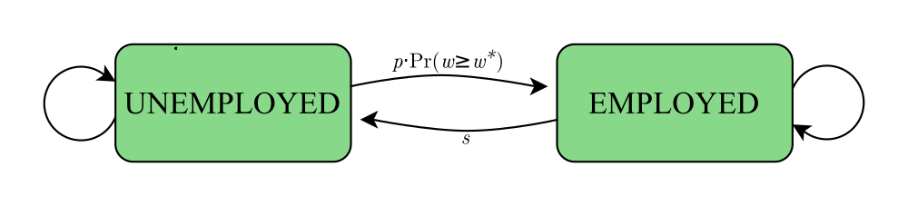

<!--

grand_parent: Notes

## Definitions

Amply Covered in https://www.rmwinslow.com/3102/measurement-labor.html
Well, maybe not the vacancy rate

vacancy rate, the participation rate, and the employment/popula-
tion ratio.
-->

<!--

## Motivating Facts

FROM BOOK
- unemployment rate is a countercyclical variable
- from the late 1960s until the mid-1980s there was a trend increase in the unemployment rate, and there was a trend decrease from the mid-1980s until the recession of 2008– 2009.
- LFPR up then slightly down for women, steady decline for men
- the labor force participation rate is much less cyclically variable than is the employment/population ratio. During a recession, workers who lose their jobs tend to search for other jobs and remain in the labor force as unemployed, rather than leave the labor force. 

## Simple Model of Job Search

In Adv Labor (ECON 4538), Textbook is ars Ljungqvist and Thomas Sargent, Recursive Macroeconomic Theory (3rd edition)

Week 2
 Introduction of Search Models of the Labor Market
  LS ch 6
  "The chapter studies ideas introduced in two important papers by McCall (1970) and Jovanovic (1979a). These
papers differ in the search technologies with which they confront an unemployed
worker.1 We also study a related model of occupational choice by Neal (1999).
"

Week 14
 Equilibrium Search and Matching (if time permits)
 Mortensen & Pissarides (1994)

(Similar to two-sided model in Williamson)

-->

Here, we model a person looking for a job. 
This person gets random job offers which they can choose to accept or reject. 

<aside markdown="block">
This kind of model is often called a "McCall Search Model", so named because a similar model appears in JJ McCall's 1970 paper, 
<a href="https://educnet.enpc.fr/pluginfile.php/29349/mod_resource/content/1/Mc%20Call_1970.pdf">Economics of information and job search</a>.
Though the model from this paper isn't quite the same as that depicted below.
</aside>

## Details of the Model

In this model, a person is either employed or unemployed.
- If they are unemployed, then:
    - They receive some unemployment benefit $b$,
    - and they search for a job:
        - There is some probability $p$ that they get a job offer.
        - If they do get a job offer, then this offer has a randomly-drawn wage $w$
        - They can choose to accept the job, or reject the job (which means they will still be unemployed tomorrow).
- If they are employed in a job with wage $w$, then:
    - They earn that wage $w$,
    - and then there is a random chance $s$ that they lose their job.

### The Reservation Wage

When should the person accept an offer with wage $w$? 
Only when the offered wage is high enough to be 'worth it'.

The **Reservation Wage**, labelled $w^\ast$, is the lowest wage which the person is willing to accept.

Label the value[^valuefunction] of being unemployed as $V_u$,
and the value of being employed with wage $w$ as $V_e(w)$.
Then:

[^valuefunction]: An agent's "value function" is related to but slightly different from their utility function. For now, you can think of the value function like "expected utility, taking into account all the possible things that could happen in the future, and assuming that your future self makes optimal decisions." 

$$V_e(w^\ast) = V_u$$

The person will accept a job offer only if $w \geq w^\ast$,
and the probability that they accept a random offer $w$
is therefore $\Pr(w \geq w^\ast)$

### Steady-state Unemployment Rate

Let's simplify the above picture by noting the transition probabilities:

- There is a probability $s$ that an employed person becomes unemployed.
- There is a probability $p \cdot \Pr(w \geq w^\ast)$ that an unemployed person becomes employed.

Let $U$ be the percentage of people who are unemployed, 
and $1-U$ the percentage employed.
Then for the flows between these two categories to be equal, it must be that:

<!--$$\text{Employed} \to \text{Unemployed} = \text{Unemployed} \to \text{Employed}$$-->

$$\textcolor{#6c71c4}{(1-U)} \cdot \textcolor{#268bd2}{s} = \textcolor{#dc322f}{U} \cdot \textcolor{#b58900}{p \cdot \Pr(w \geq w^\ast)}$$

The amount of  employed people 
who lose their job equals 
the amount of unemployed people 
who start a new job.

<!--TODO: Needs citation or graph/-->

<!--TODO: calculate equilibrium U-->

Solving for $U$, we find the steady-state unemployment rate is

$$U = \frac{s}{s+p\cdot\Pr(w \geq w^\ast)}$$

<aside>
In practice, the actual unemployment rate closely matches the steady-state unemployment calculated from job loss and gain probabilities. This suggests that in aggregate, labor markets are quick to adjust.
</aside>

<!--TODO: notes about transitions-->

<!--TODO: mean preserving spread-->

<!--TODO: Beveridge curve went all wonky during covid. Focus discussion of 2-sided model on explaining how that may be because of ???.-->

<!--
- Value of being employed with wage $w$ is $V_e(w)$
- Value of being unemployed is $V_u$
- Probability of job offer if unemployed is $p$
- Separation rate $s$
- Reservation wage $w^\ast$
- Unemployment benefit $b$

- Fraction of unemployed workers is $U$
- Fraction of employed workers is $E$
-->

<!--
One sided and two sided?

The two-sided search model of unemployment is based on the work of Peter
Diamond, Dale Mortensen, and Christopher Pissarides, for which they received the
Nobel Prize in Economics in 2010. 

Job Openings and Labor Turnover Survey (JOLTS) conducted by the Bureau of
Labor Statistics
-->

## Other Search Models

Many other variants of search and matching models exist.

For example, one can build a *Two-sided* model of search, 
where unemployed workers are looking for jobs,
and where firms are looking for workers to fill vacant positions.

These kinds of two-sided search models are concerned not just with the unemployment rate, 
but also the **vacancy rate**, which is the portion of job positions which currently lack a worker filling them.
(The BLS also uses the term "job openings rate". This is synonymous with "vacancy rate".)

## Links

- Some Graphs from the BLS' Job Openings and Labor Turnover Survey:
    - [Hires and Seperations rates](https://www.bls.gov/charts/job-openings-and-labor-turnover/hire-seps-rates.htm)
    - [A curve plotting Unemployment Rates vs Vacancy Rates](https://www.bls.gov/charts/job-openings-and-labor-turnover/job-openings-unemployment-beveridge-curve.htm) (aka "The Beveridge Curve")

<!--
https://www.bls.gov/charts/job-openings-and-labor-turnover/opening-industry.htm
https://www.bls.gov/charts/job-openings-and-labor-turnover/unemp-per-job-opening.htm
https://julia.quantecon.org/dynamic_programming/mccall_model.html
-->

