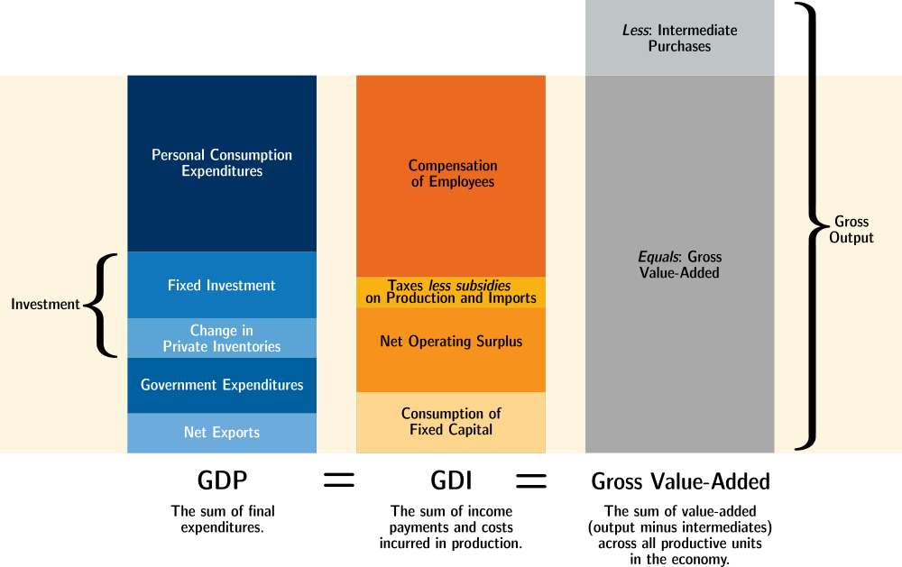

<!--
https://www.bea.gov/system/files/2020-04/GDP-Education-by-BEA.pdf
https://www.cia.gov/the-world-factbook/field/real-gdp-purchasing-power-parity/country-comparison
https://apps.bea.gov/iTable/iTable.cfm?reqid=19&step=3&isuri=1&nipa_table_list=289&categories=survey
-->

## What is GDP?

**Concept:** How much stuff is being made?

**Definition:** The dollar value of all final goods and services produced during a given period of time within a region’s borders.

- Dollar value: The only way we can compare and add up many thousands of different types of goods is using using the value for which they sell
    - For most goods and services, it's their market value which is counted towards the National Accounts. 
    - The BEA and other agencies have some notable exceptions, such as including the "market value" of in-kind payments. When workers are paid with a portion of the output (as is common in agriculture), these in-kind payments are never sold, but are counted towards GDP *as if* they had been sold at the same price that similar goods sell for.
    - Inventories are counted as final goods in the form of investment, and are likewise counted towards gdp at the average price at which they could sell.
- **Final** goods and services
    - We don’t include intermediate goods. (ex: We don’t count a tomato if its used in a can of tomato sauce). This avoids double counting.
- Produced within a region: GDP defines a country or region by its geographical borders. Any production that occurs physically within a country counts towards GDP.
    - By contrast, GNP (Gross National Product) defines a country or region by its people. GNP is the same as GDP except GNP that looks at goods produced by the *residents* of a region.
- within a time period

<!--
But the dollar value of some goods must be *imputed*.
A full list of imputations here
https://apps.bea.gov/iTable/iTable.cfm?reqid=19&step=3&isuri=1&nipa_table_list=289&categories=survey
he largest NIPA imputation is that made to approximate the value of the services
provided by owner-occupied housing. This imputation is made so that the treatment of
owner-occupied housing in the accounts is comparable to that for tenant-occupied
housing (which is valued by rent paid), thereby keeping GDP invariant as to whether a
house is owned or rented. In the NIPAs, the purchase of a new house (excluding the value
of the unimproved land) is treated as an investment, the ownership of the home is treated
as a productive enterprise, and a service is assumed to flow, over its economic life, from
the house to the occupant. For the homeowner, the value of this service is measured as
the income the homeowner could have received if the house had been rented to a tenant.-->

<!--https://www.cia.gov/the-world-factbook/field/real-gdp-purchasing-power-parity/country-comparison-->

## Approaches to Measuring GDP

There are three ways to measure GDP.
In theory, all three approaches should yield the same total value.

<figure markdown="block">

<figcaption>Three ways to measure GDP. Recreation of figure 2.1 from the BEA's NIPA Handbook. GDP components not to scale.</figcaption>
</figure>

\newpage{}

### Expenditure Approach:

Measures output by looking at where that output goes.

$$C + I + G + NX$$

- **C**: personal Consumption expenditures, or "Consumption" for short
    - This is the largest component of GDP, and represents households (like mine or yours) purchasing things to use, and hiring people to perform services.
- **I**: Investment, including inventory changes
    - *Fixed Investment*, also called "fixed capital formation", is spending on new equipment, structures, and intellectual property which will help create output in the future.[^InvestmentIntermediateDifference] Fixed Investment adds to the capital stock, and is what we more typically think of as "investment".
    - New housing is also counted as fixed investment, even if purchased for yourself. 
    - *Inventory changes* are included in GDP for the sake of making the measurement consistent across time. If a good is added to inventory, it counts towards GDP. And if a good is removed from inventory, it subtracts from GDP. This ensures that goods are counted towards GDP in the year in which they are produced. 
- **G**: Government consumption expenditures and gross investment
    - Whenever the government buys something, it adds to this component of GDP.
    - When the government transfers money (as with social security), it does not add to GDP. (Remember that GDP measures the amount of stuff being made.)
- **NX**: Net eXports (Exports - Imports) of goods and services.
    - If I import a good to consume, the purchase of that good adds to GDP via Consumption, even though it wasn't produced in the US. By subtracting imports, that purchase is cancelled out.
    - For the past several decades, the US has imported more than it has exported, and so the US' net exports have been negative.

[^InvestmentIntermediateDifference]: Investments and intermediate inputs are not the same thing. Both are used to create other goods, but an intermediate input goes *into* the final good or is otherwise transformed, whereas fixed investment goods, aka capital, can be used to produce many units of output over several years. The flour that goes into the bread is an intermediate input; the oven that bakes it is an investment.

The expenditure approach is considered the fastest and most reliable way to measure GDP.

\newpage{}

<!-- 
If a cheese wheel is produced this year, we want it to count towards GDP this year, even if it I don't buy it to eat until next year. And when I do buy that cheese wheel next year, we w
(This is done to make measurements more consistent.)
Government investment is always counted, but where it goes in the formula varies. BEA lumps Gov consumption and invesetment together. OECD seems to seperate them. Need to double check on that before uncommenting this part.-->

### Value-added Approach:

The Value-added Approach, also called the Output or Product Approach,[^OutputApproachNames] 
measures output by looking at where final goods and services are coming from.

[^OutputApproachNames]: Our Textbook (Williamson 6th Edition) calls this the "Product Approach". The BEA's NIPA Handbook calls this the "Value-added Approach" or the "Production Approach". The OECD, at [stats.oecd.org](https://stats.oecd.org/), labels this the "Output Approach"

**Problem:** Firms know their outputs and inputs, but don’t know which outputs are final vs which are intermediate.  
**Solution:** Inputs to a firm are always intermediate, so we can add up all the output from all firms and subtract out all
the intermediate inputs. Intermediate goods cancel out, while final goods remain uncancelled.

A firm’s value added is (That firm’s revenue, including inventory changes) minus (That firm’s input costs of intermediate goods and services).

You can also calculate Value-added Approach GDP simply by adding up each firm’s value-added.

### Income Approach: 

The Income-expenditure identity says that aggregate income will be equal to aggregate output.
If a dollar flows into industry because of the purchase of some final good or service,
that dollar must also flow out of industry into someone's pockets.

Income Approach GDP, also called Gross Domestic Income, measures output by adding up all the income that happens as a result of production.

There are different ways to split up this income, but the main categories are:

- Compensation of Employees
    - Wages and Salaries, including the value of in-kind payments, are the biggest component of GDI
    - Supplements to wages and salaries, such as the employer's contribution to Social Security, are also included as employee compensation.
- Net Taxes on production and imports
    - sales tax, VAT, for example are included
    - Personal income tax is *not* included because that money was already measured as part of compensation.
- Net Operating Surplus. This can be thought of as "profits", but is different than the accounting definition of the term.
    – Net interest, specifically on debt owed by/to firms.
    - Proprietor's Income
    - Rental Income
    - Corporate Profits
- Consumption of Fixed Capital, which you can think of as "depreciation". 

<!--To do: more details about net operating surplus, espcially inventory and capital adjustments-->

<!--
- Taxes less subsidies on production and imports. 
Note that not *all* tax revenue is counted towards GDI, only revenue from taxes directly related to current output.
For example, personal income taxes wouldn't be counted because that income is already counted under wages and salaries.-->

---

## Links

- [NIPA Handbook: Concepts and Methods of the U.S. National Income and Product Accounts](https://www.bea.gov/resources/methodologies/nipa-handbook) - detailed description of the National Accounts for the US.

## Tables

### US Expenditure Approach GDP with components

<table>
<thead >
  <tr>
    <th></th>
    <th colspan="3" style="text-align: center;">Trillions USD</th>
    <th colspan="3" style="text-align: center;">Percent</th>
  </tr>
  <tr>
    <th></th>
    <th>2019</th>
    <th>2020</th>
    <th>2021</th>
    <th>2019</th>
    <th>2020</th>
    <th>2021</th>
  </tr>
</thead>
<tbody>
  <tr>
    <td>Gross domestic product</td>
    <td>21.4</td>
    <td>20.9</td>
    <td>23.0</td>
    <td>100%</td>
    <td>100%</td>
    <td>100%</td>
  </tr>
  <tr style="font-weight:bold;">
    <td>Personal consumption expenditures</td>
    <td>14.4</td>
    <td>14.0</td>
    <td>15.7</td>
    <td>67.5%</td>
    <td>67.2%</td>
    <td>68.5%</td>
  </tr>
  <tr>
    <td style="padding-left:1em;">Goods</td>
    <td>4.5</td>
    <td>4.7</td>
    <td>5.5</td>
    <td>21.0%</td>
    <td>22.3%</td>
    <td>23.8%</td>
  </tr>
  <tr>
    <td style="padding-left:2em;">Durable goods</td>
    <td>1.5</td>
    <td>1.6</td>
    <td>2.0</td>
    <td>7.1%</td>
    <td>7.7%</td>
    <td>8.8%</td>
  </tr>
  <tr>
    <td style="padding-left:2em;">Nondurable goods</td>
    <td>3.0</td>
    <td>3.0</td>
    <td>3.5</td>
    <td>13.9%</td>
    <td>14.5%</td>
    <td>15.0%</td>
  </tr>
  <tr>
    <td style="padding-left:1em;">Services</td>
    <td>9.9</td>
    <td>9.4</td>
    <td>10.3</td>
    <td>46.6%</td>
    <td>45.0%</td>
    <td>44.6%</td>
  </tr>
  <tr style="font-weight:bold;">
    <td>Gross private domestic investment</td>
    <td>3.8</td>
    <td>3.6</td>
    <td>4.1</td>
    <td>17.9%</td>
    <td>17.4%</td>
    <td>17.9%</td>
  </tr>
  <tr>
    <td style="padding-left:1em;">Fixed investment</td>
    <td>3.8</td>
    <td>3.7</td>
    <td>4.1</td>
    <td>17.6%</td>
    <td>17.7%</td>
    <td>18.0%</td>
  </tr>
  <tr>
    <td style="padding-left:2em;">Nonresidential</td>
    <td>2.9</td>
    <td>2.8</td>
    <td>3.1</td>
    <td>13.7%</td>
    <td>13.4%</td>
    <td>13.3%</td>
  </tr>
  <tr>
    <td style="padding-left:3em;">Structures</td>
    <td>0.7</td>
    <td>0.6</td>
    <td>0.6</td>
    <td>3.1%</td>
    <td>2.9%</td>
    <td>2.5%</td>
  </tr>
  <tr>
    <td style="padding-left:3em;">Equipment</td>
    <td>1.2</td>
    <td>1.1</td>
    <td>1.3</td>
    <td>5.8%</td>
    <td>5.4%</td>
    <td>5.5%</td>
  </tr>
  <tr>
    <td style="padding-left:3em;">Intellectual property products</td>
    <td>1.0</td>
    <td>1.1</td>
    <td>1.2</td>
    <td>4.8%</td>
    <td>5.2%</td>
    <td>5.2%</td>
  </tr>
  <tr>
    <td style="padding-left:3em;">Residential</td>
    <td>0.8</td>
    <td>0.9</td>
    <td>1.1</td>
    <td>3.8%</td>
    <td>4.3%</td>
    <td>4.7%</td>
  </tr>
  <tr>
    <td style="padding-left:1em;">Change in private inventories</td>
    <td>0.1</td>
    <td>-0.1</td>
    <td>0.0</td>
    <td>0.3%</td>
    <td>-0.3%</td>
    <td>-0.1%</td>
  </tr>
  <tr style="font-weight:bold;">
    <td>Net exports of goods and services</td>
    <td>-0.6</td>
    <td>-0.7</td>
    <td>-0.9</td>
    <td>-2.8%</td>
    <td>-3.1%</td>
    <td>-4.0%</td>
  </tr>
  <tr>
    <td style="padding-left:1em;"> Exports</td>
    <td>2.5</td>
    <td>2.1</td>
    <td>2.5</td>
    <td>11.8%</td>
    <td>10.2%</td>
    <td>10.8%</td>
  </tr>
  <tr>
    <td style="padding-left:2em;">Goods</td>
    <td>1.6</td>
    <td>1.4</td>
    <td>1.7</td>
    <td>7.7%</td>
    <td>6.8%</td>
    <td>7.6%</td>
  </tr>
  <tr>
    <td style="padding-left:2em;">Services</td>
    <td>0.9</td>
    <td>0.7</td>
    <td>0.7</td>
    <td>4.1%</td>
    <td>3.4%</td>
    <td>3.2%</td>
  </tr>
  <tr>
    <td style="padding-left:1em;">Imports</td>
    <td>3.1</td>
    <td>2.8</td>
    <td>3.4</td>
    <td>14.6%</td>
    <td>13.3%</td>
    <td>14.8%</td>
  </tr>
  <tr>
    <td style="padding-left:2em;">Goods</td>
    <td>2.5</td>
    <td>2.3</td>
    <td>2.8</td>
    <td>11.8%</td>
    <td>11.1%</td>
    <td>12.4%</td>
  </tr>
  <tr>
    <td style="padding-left:2em;">Services</td>
    <td>0.6</td>
    <td>0.5</td>
    <td>0.5</td>
    <td>2.8%</td>
    <td>2.2%</td>
    <td>2.4%</td>
  </tr>
  <tr style="font-weight:bold;">
    <td>Government consumption expenditures and gross investment</td>
    <td>3.7</td>
    <td>3.9</td>
    <td>4.1</td>
    <td>17.4%</td>
    <td>18.5%</td>
    <td>17.6%</td>
  </tr>
  <tr>
    <td style="padding-left:1em;">Federal</td>
    <td>1.4</td>
    <td>1.5</td>
    <td>1.6</td>
    <td>6.6%</td>
    <td>7.2%</td>
    <td>6.8%</td>
  </tr>
  <tr>
    <td style="padding-left:2em;">National defense</td>
    <td>0.8</td>
    <td>0.9</td>
    <td>0.9</td>
    <td>4.0%</td>
    <td>4.2%</td>
    <td>3.9%</td>
  </tr>
  <tr>
    <td style="padding-left:2em;">Nondefense</td>
    <td>0.6</td>
    <td>0.6</td>
    <td>0.7</td>
    <td>2.7%</td>
    <td>3.0%</td>
    <td>2.9%</td>
  </tr>
  <tr>
    <td style="padding-left:1em;">State and local</td>
    <td>2.3</td>
    <td>2.4</td>
    <td>2.5</td>
    <td>10.8%</td>
    <td>11.3%</td>
    <td>10.8%</td>
  </tr>
</tbody>
</table>

------------------------

### US Income Approach GDP with components

<table>
<thead>
  <tr>
    <th></th>
    <th colspan="3" style="text-align: center;">Trillions USD</th>
    <th colspan="3" style="text-align: center;">Percent</th>
  </tr>
  <tr>
    <th></th>
    <th>2019</th>
    <th>2020</th>
    <th>2021</th>
    <th>2019</th>
    <th>2020</th>
    <th>2021</th>
  </tr>
</thead>
<tbody>
  <tr>
    <td>Gross domestic income</td>
    <td>21.4</td>
    <td>21.1</td>
    <td>23.8</td>
    <td>100%</td>
    <td>100%</td>
    <td>100%</td>
  </tr>
  <tr style="font-weight:bold;">
    <td>Compensation of employees, paid</td>
    <td>11.5</td>
    <td>11.6</td>
    <td>12.9</td>
    <td>53.4%</td>
    <td>55.0%</td>
    <td>54.2%</td>
  </tr>
  <tr>
    <td style="padding-left:1em;">Wages and salaries</td>
    <td>9.3</td>
    <td>9.5</td>
    <td>10.6</td>
    <td>43.5%</td>
    <td>44.9%</td>
    <td>44.6%</td>
  </tr>
  <tr>
    <td style="padding-left:2em;">To persons</td>
    <td>9.3</td>
    <td>9.4</td>
    <td>10.6</td>
    <td>43.4%</td>
    <td>44.8%</td>
    <td>44.6%</td>
  </tr>
  <tr>
    <td style="padding-left:2em;">To the rest of the world</td>
    <td>0.0</td>
    <td>0.0</td>
    <td>0.0</td>
    <td>0.1%</td>
    <td>0.1%</td>
    <td>0.1%</td>
  </tr>
  <tr>
    <td style="padding-left:1em;">Supplements to wages and salaries</td>
    <td>2.1</td>
    <td>2.1</td>
    <td>2.3</td>
    <td>9.9%</td>
    <td>10.1%</td>
    <td>9.6%</td>
  </tr>
  <tr style="font-weight:bold;">
    <td>Taxes less subsidies on production and imports</td>
    <td>1.5</td>
    <td>0.8</td>
    <td>1.2</td>
    <td>6.8%</td>
    <td>3.7%</td>
    <td>4.8%</td>
  </tr>
  <tr>
    <td style="padding-left:1em;">Taxes on production and imports</td>
    <td>1.5</td>
    <td>1.5</td>
    <td>1.6</td>
    <td>7.1%</td>
    <td>7.3%</td>
    <td>6.9%</td>
  </tr>
  <tr>
    <td style="padding-left:1em;">Less: Subsidies</td>
    <td>0.1</td>
    <td>0.8</td>
    <td>0.5</td>
    <td>0.3%</td>
    <td>3.6%</td>
    <td>2.1%</td>
  </tr>
  <tr style="font-weight:bold;">
    <td>Net operating surplus</td>
    <td>5.1</td>
    <td>5.1</td>
    <td>5.9</td>
    <td>23.7%</td>
    <td>24.4%</td>
    <td>24.8%</td>
  </tr>
  <tr>
    <td style="padding-left:1em;">Private enterprises</td>
    <td>5.1</td>
    <td>5.2</td>
    <td>5.9</td>
    <td>23.8%</td>
    <td>24.5%</td>
    <td>24.8%</td>
  </tr>
  <tr>
    <td style="padding-left:2em;">Net interest and miscellaneous payments, domestic industries</td>
    <td>0.8</td>
    <td>0.8</td>
    <td>0.9</td>
    <td>3.7%</td>
    <td>4.0%</td>
    <td>3.8%</td>
  </tr>
  <tr>
    <td style="padding-left:2em;">Business current transfer payments (net)</td>
    <td>0.2</td>
    <td>0.2</td>
    <td>0.2</td>
    <td>0.8%</td>
    <td>0.8%</td>
    <td>0.7%</td>
  </tr>
  <tr>
    <td style="padding-left:2em;">Proprietors' income with inventory valuation and capital consumption&nbsp;&nbsp;&nbsp;adjustments</td>
    <td>1.6</td>
    <td>1.7</td>
    <td>1.8</td>
    <td>7.5%</td>
    <td>7.8%</td>
    <td>7.6%</td>
  </tr>
  <tr>
    <td style="padding-left:2em;">Rental income of persons with capital consumption adjustment</td>
    <td>0.7</td>
    <td>0.7</td>
    <td>0.7</td>
    <td>3.2%</td>
    <td>3.4%</td>
    <td>3.1%</td>
  </tr>
  <tr>
    <td style="padding-left:2em;" >Corporate profits with inventory valuation and capital consumption adjustments, domestic industries</td>
    <td>1.9</td>
    <td>1.8</td>
    <td>2.3</td>
    <td>8.6%</td>
    <td>8.5%</td>
    <td>9.6%</td>
  </tr>
  <tr>
    <td style="padding-left:3em;">Taxes on corporate income</td>
    <td>0.3</td>
    <td>0.3</td>
    <td>0.4</td>
    <td>1.4%</td>
    <td>1.3%</td>
    <td>1.7%</td>
  </tr>
  <tr>
    <td style="padding-left:3em;">Profits after tax with inventory valuation and capital consumption adjustments</td>
    <td>1.6</td>
    <td>1.5</td>
    <td>1.9</td>
    <td>7.2%</td>
    <td>7.2%</td>
    <td>7.9%</td>
  </tr>
  <tr>
    <td style="padding-left:4em;">Net dividends</td>
    <td>0.9</td>
    <td>1.1</td>
    <td>1.2</td>
    <td>4.3%</td>
    <td>5.2%</td>
    <td>4.9%</td>
  </tr>
  <tr>
    <td style="padding-left:4em;">Undistributed corporate profits with inventory valuation and capital consumption adjustments</td>
    <td>0.6</td>
    <td>0.4</td>
    <td>0.7</td>
    <td>2.9%</td>
    <td>2.0%</td>
    <td>3.0%</td>
  </tr>
  <tr>
    <td style="padding-left:1em;">Current surplus of government enterprises</td>
    <td>0.0</td>
    <td>0.0</td>
    <td>0.0</td>
    <td>-0.1%</td>
    <td>-0.1%</td>
    <td>-0.1%</td>
  </tr>
  <tr style="font-weight:bold;">
    <td>Consumption of fixed capital</td>
    <td>3.4</td>
    <td>3.6</td>
    <td>3.8</td>
    <td>16.0%</td>
    <td>17.0%</td>
    <td>16.2%</td>
  </tr>
  <tr>
    <td style="padding-left:1em;">Private</td>
    <td>2.8</td>
    <td>3.0</td>
    <td>3.2</td>
    <td>13.3%</td>
    <td>14.1%</td>
    <td>13.5%</td>
  </tr>
  <tr>
    <td style="padding-left:1em;">Government</td>
    <td>0.6</td>
    <td>0.6</td>
    <td>0.6</td>
    <td>2.7%</td>
    <td>2.9%</td>
    <td>2.7%</td>
  </tr>
</tbody>
</table>

<!--
https://www.nber.org/digest/may17/global-rise-corporate-saving
https://news.research.stlouisfed.org/2022/06/fred-maps-rise-as-geofred-sets/
https://fred.stlouisfed.org/series/CPATAX
https://fred.stlouisfed.org/series/A446RC1Q027SBEA
-->

---
