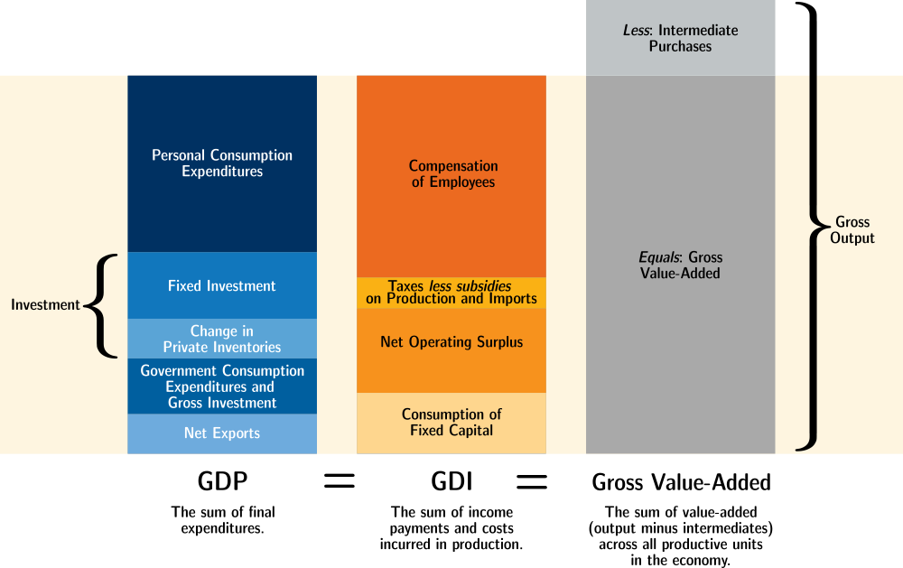

<!--
https://www.bea.gov/system/files/2020-04/GDP-Education-by-BEA.pdf
https://www.cia.gov/the-world-factbook/field/real-gdp-purchasing-power-parity/country-comparison
https://apps.bea.gov/iTable/iTable.cfm?reqid=19&step=3&isuri=1&nipa_table_list=289&categories=survey
-->

## What is GDP?

**Basic Concept:** How much stuff is being made?

**Definition:** GDP is the the total dollar value of all final goods and services produced during a given period of time within a region’s borders.

Each part of this definition is important.

- Dollar value: The only way we can compare and add up many thousands of different types of goods is using using the value for which they sell
    - For most goods and services, it's their market value which is counted towards the National Accounts. 
    - The BEA and other agencies have some notable exceptions, such as including the "market value" of in-kind payments. When workers are paid with a portion of the output (as is common in agriculture), these in-kind payments are never sold, but are counted towards GDP *as if* they had been sold at the same price that similar goods sell for.
    - Inventories are counted as final goods in the form of investment, and are likewise counted towards gdp at the average price at which they *could* sell.
- **Final** goods and services
    - We don’t include intermediate goods. (ex: We don’t count a tomato if its used in a can of tomato sauce). This avoids double counting.
- Produced within a region: GDP defines a country or region by its geographical borders. Any production that occurs physically within a country counts towards GDP.
    - By contrast, GNP (Gross National Product) defines a country or region by its people. GNP is the same as GDP except GNP that looks at goods produced by the *residents* of a region.
- Within a time period.
    - GDP data is typically quarterly or annual. Quarterly data is typically seasonally adjusted.
    - Inventory changes are counted towards GDP so that goods add to GDP in the time period in which they are produced.

<!--
But the dollar value of some goods must be *imputed*.
A full list of imputations here
https://apps.bea.gov/iTable/iTable.cfm?reqid=19&step=3&isuri=1&nipa_table_list=289&categories=survey
he largest NIPA imputation is that made to approximate the value of the services
provided by owner-occupied housing. This imputation is made so that the treatment of
owner-occupied housing in the accounts is comparable to that for tenant-occupied
housing (which is valued by rent paid), thereby keeping GDP invariant as to whether a
house is owned or rented. In the NIPAs, the purchase of a new house (excluding the value
of the unimproved land) is treated as an investment, the ownership of the home is treated
as a productive enterprise, and a service is assumed to flow, over its economic life, from
the house to the occupant. For the homeowner, the value of this service is measured as
the income the homeowner could have received if the house had been rented to a tenant.-->

<!--https://www.cia.gov/the-world-factbook/field/real-gdp-purchasing-power-parity/country-comparison-->

## Approaches to Measuring GDP

There are three ways to measure GDP.
These are the Expenditure Approach, the Value-Added Approach (aka Product Approach), and the Income Approach.

- The Expenditure Approach measures the amount of stuff produced by looking at where that stuff ends up, and is considered the fastest and most reliable way to measure GDP.
- The Value-Added Approach measures output by adding up the amount being produced from each unit in the economy and subtracting inputs to avoid double-counting.
- The income approach measures output indirectly by looking at the income which people earn as a result of producing that output.

In theory, all three approaches should yield the same total value. 
(In practice, there are small discrepancies.) 
Essentially, they answer the same question by looking at different sets of paperwork.

<figure markdown="block">

<figcaption>Three ways to measure GDP. Recreation of figure 2.1 from the BEA's NIPA Handbook. GDP components not to scale.</figcaption>
</figure>

### Expenditure Approach:

Measures output by looking at where that output goes.

$$C + I + G + NX$$

- **C**: personal Consumption expenditures, or "Consumption" for short
    - This is the largest component of GDP, and represents households (like mine or yours) purchasing things to use, and hiring people to perform services.
- **I**: Investment, including inventory changes
    - *Fixed Investment*, also called "fixed capital formation", is spending on new equipment, structures, and intellectual property which will help create output in the future.[^InvestmentIntermediateDifference] Fixed Investment adds to the capital stock, and is what we more typically think of as "investment".
    - New housing is also counted as fixed investment, even if purchased for yourself. 
    - *Inventory changes* are included in GDP for the sake of making the measurement consistent across time. If a good is added to inventory, it counts towards GDP. And if a good is removed from inventory, it subtracts from GDP. This ensures that goods are counted towards GDP in the year in which they are produced. 
- **G**: Government consumption expenditures and gross investment
    - Whenever the government buys something, it adds to this component of GDP.
    - When the government transfers money (as with social security), it does not add to GDP. (Remember that GDP measures the amount of stuff being made.)
- **NX**: Net eXports (eXports minus iMports) of goods and services.
    - If I import a good to consume, the purchase of that good adds to GDP via Consumption, even though it wasn't produced in the US. By subtracting imports, that purchase is cancelled out.
    - For the past several decades, the US has imported more than it has exported, and so the US' net exports have been negative.

[^InvestmentIntermediateDifference]: Investments and intermediate inputs are not the same thing. Both are used to create other goods, but an intermediate input goes *into* the final good or is otherwise transformed, whereas fixed investment goods, aka capital, can be used to produce many units of output over several years. The flour that goes into the bread is an intermediate input; the oven that bakes it is an investment.

<!--
Table 5.1 shows the kinds of transactions that are included in and excluded from
PCE. Most of PCE consists of purchases of new goods and of services by households
from private business. In addition, PCE includes purchases of new goods and of services
by households from government and government enterprises, the costs incurred by
NPISHs in providing services on behalf of households, net purchases of used goods by
households, and purchases abroad of goods and services by U.S. residents traveling,
working, or attending school in foreign countries. PCE also includes expenditures
financed by third-party payers on behalf of households, such as employer-paid health
insurance and medical care financed through government programs, and it includes
expenses associated with life insurance and with private and government employee
pension plans. Finally, PCE includes imputed purchases that keep PCE invariant to
changes in the way that certain activities are carried out—for example, whether housing
is rented or owned or whether employees are paid in cash or in kind. PCE transactions are
valued in market prices, including sales and excise taxes.
In the NIPAs, final consumption expenditures by NPISHs is the portion of PCE
that represents the services that are provided to households by NPISHs without explicit
charge (such as the value of the education services provided by a nonprofit college or
university that is over and above the tuition and other costs paid by or for the student’s
household). It is equal to their gross output, which is measured as their current operating
expenses (not including purchases of buildings and equipment, which are treated as
private fixed investment), less their sales to households and to other sectors of the
economy (such as sales of education services to employers) and less the value of any
investment goods (such as software) that are produced directly by the NPISH. Services
that are provided by NPISHs and are paid by or on behalf of households (such as the 
-->

<!-- 
If a cheese wheel is produced this year, we want it to count towards GDP this year, even if it I don't buy it to eat until next year. And when I do buy that cheese wheel next year, we w
(This is done to make measurements more consistent.)
Government investment is always counted, but where it goes in the formula varies. BEA lumps Gov consumption and invesetment together. OECD seems to seperate them. Need to double check on that before uncommenting this part.-->

### Value-added Approach:

The Value-added Approach, also called the Output or Product Approach,[^OutputApproachNames] 
measures output by looking at where final goods and services are coming from.

[^OutputApproachNames]: Our Textbook (Williamson 6th Edition) calls this the "Product Approach". The BEA's NIPA Handbook calls this the "Value-added Approach" or the "Production Approach". The OECD, at [stats.oecd.org](https://stats.oecd.org/), labels this the "Output Approach"

**Problem:** Firms know their outputs and inputs, but don’t know which outputs are final vs which are intermediate.  
**Solution:** Inputs to a firm are always intermediate, so we can add up all the output from all firms and subtract out all
the intermediate inputs. Intermediate goods cancel out, while final goods remain uncancelled.

A firm’s value added is (That firm’s revenue, including inventory changes) minus (That firm’s input costs of intermediate goods and services).

You can also calculate Value-added Approach GDP simply by adding up each firm’s value-added.

### Income Approach: 

The Income-expenditure identity says that aggregate income will be equal to aggregate output.
To simplify a bit: 
If a dollar flows into industry because of the purchase of some final good or service,
that dollar must also flow out of industry into someone's pockets.

Income Approach GDP, also called Gross Domestic Income, measures output by adding up all the income that happens as a result of production.

There are different ways to split up this income, but the main categories are:

- Compensation of Employees
    - Wages and Salaries, including the value of in-kind payments, are the biggest component of GDI
    - Supplements to wages and salaries, such as the employer's contribution to Social Security, are also included as employee compensation.
- Net Taxes on production and imports
    - sales tax, VAT, for example are included
    - Personal income tax is *not* included because that money was already measured as part of compensation.
- Net Operating Surplus. This can be thought of as "profits", but is different than the accounting definition of the term.
    - Net interest, specifically on debt owed by/to firms.
    - Proprietor's Income
    - Rental Income
    - Corporate Profits
- Consumption of Fixed Capital, which you can think of as "depreciation". 

<!--To do: more details about net operating surplus, espcially inventory and capital adjustments-->

<!--
- Taxes less subsidies on production and imports. 
Note that not *all* tax revenue is counted towards GDI, only revenue from taxes directly related to current output.
For example, personal income taxes wouldn't be counted because that income is already counted under wages and salaries.-->

<!--TODO: List of imputations on GDP-->

## Related Measurements

- **Gross National Product** adds up the production from factors of production owned by residents[^residentsDefinition] of a region.
    - The main difference between GNP and GDP has to do with income from foreign-owned investments. 
    - The difference between GDP and GNP is called " net income payments from the rest of the world" or "net factor payments from abroad" (NFP). GNP = GDP + NFP
    - In general "domestic" statistics define a region by its physical borders, "national" statistics define a region by its residents.
- **Gross Output** is the dollar value of all transactions, without subtracting intermediate inputs. (This results in double counting.)
- **Net Domestic Product** is GDP minus the consumption of fixed capital (depreciation). NDP represents the total amount of output that can be potentially be consumed or used to expand the capital stock.

[^residentsDefinition]: If you are a "resident" of a region, this means that you are living there long-term. In the BEA's definition, someone is a US resident if they "reside or expect to reside in the United States for 1 year or more", with exceptions for students, soldiers, diplomats, etc. The residents of a region also include that regions governments, and firms established under that region's laws. 

<!--
Gross National Product
: Whereas "domestic" statistics define a region by its physical borders, "national" statistics define a region by its residents.
: Gross National Product adds up the production from factors of production owned by residents of a country.
: 
If a US resident owns part of a factory in Japan, then none of that factory's output counts towards US GDP. But if the factory pays profits to the American, those profits *are* counted towards -->

<!--
Thus, for an assembly plant that is owned by a Japanese auto company and located in the
United States, all of its output is included in GDP, but only the portion of the value that
reflects U.S. residents’ labor and property is included in GNP. And, for an assembly plant
that is owned by a U.S. auto company and located in Great Britain, none of its output is
included in GDP, but the portion of the value that reflects U.S. residents’ labor or
property is included in GNP.

International organizations
such as the United Nations, the International Monetary Fund, and the International Bank
for Reconstruction and Development are considered residents of an international area
beyond national boundaries, rather than residents of the country in which they are located
or in which they operate
-->

## Links

- [NIPA Handbook: Concepts and Methods of the U.S. National Income and Product Accounts](https://www.bea.gov/resources/methodologies/nipa-handbook) - detailed description of the National Accounts for the US.
- [OECD stats website](https://stats.oecd.org/). You can find real-world GDP data in the menu under "National Accounts > Annual National Accounts > Main Aggregates > GDP"

- Graphs from FRED
    - [Graph of US GDP (nominal, per-quarter at annual rate, seasonally adjusted)](https://fred.stlouisfed.org/series/gdp)
    - [Expenditure Approach GDP Components as share of total.](https://fred.stlouisfed.org/graph/?g=TnqK)
    - [Income Approach GDP Components as share of total.](https://fred.stlouisfed.org/graph/?g=Tnty)

<!--There are links to some interesting blog posts under this FRED graph
    - [GDP Expenditure Approach Components Table](https://fred.stlouisfed.org/release/tables?rid=53&eid=12998)

https://fredaccount.stlouisfed.org/public/dashboard/17831
https://fredblog.stlouisfed.org/2016/06/2393/
- [Same Graph as above, but with "Taxes on corporate income" lumped in with Taxes on production and imports](https://fred.stlouisfed.org/graph/?g=TntI)
- [GDI components / GDP, with statistical discrepancy](https://fred.stlouisfed.org/graph/?g=Tnuk)
-->

## Tables

### US Expenditure Approach GDP with components

<table>
<thead >
  <tr>
    <th></th>
    <th colspan="3" style="text-align: center;">Trillions USD</th>
    <th colspan="3" style="text-align: center;">Percent</th>
  </tr>
  <tr>
    <th></th>
    <th>2019</th>
    <th>2020</th>
    <th>2021</th>
    <th>2019</th>
    <th>2020</th>
    <th>2021</th>
  </tr>
</thead>
<tbody>
  <tr>
    <td>Gross domestic product</td>
    <td>21.4</td>
    <td>20.9</td>
    <td>23.0</td>
    <td>100%</td>
    <td>100%</td>
    <td>100%</td>
  </tr>
  <tr style="font-weight:bold;">
    <td>Personal consumption expenditures</td>
    <td>14.4</td>
    <td>14.0</td>
    <td>15.7</td>
    <td>67.5%</td>
    <td>67.2%</td>
    <td>68.5%</td>
  </tr>
  <tr>
    <td style="padding-left:1em;">Goods</td>
    <td>4.5</td>
    <td>4.7</td>
    <td>5.5</td>
    <td>21.0%</td>
    <td>22.3%</td>
    <td>23.8%</td>
  </tr>
  <tr>
    <td style="padding-left:2em;">Durable goods</td>
    <td>1.5</td>
    <td>1.6</td>
    <td>2.0</td>
    <td>7.1%</td>
    <td>7.7%</td>
    <td>8.8%</td>
  </tr>
  <tr>
    <td style="padding-left:2em;">Nondurable goods</td>
    <td>3.0</td>
    <td>3.0</td>
    <td>3.5</td>
    <td>13.9%</td>
    <td>14.5%</td>
    <td>15.0%</td>
  </tr>
  <tr>
    <td style="padding-left:1em;">Services</td>
    <td>9.9</td>
    <td>9.4</td>
    <td>10.3</td>
    <td>46.6%</td>
    <td>45.0%</td>
    <td>44.6%</td>
  </tr>
  <tr style="font-weight:bold;">
    <td>Gross private domestic investment</td>
    <td>3.8</td>
    <td>3.6</td>
    <td>4.1</td>
    <td>17.9%</td>
    <td>17.4%</td>
    <td>17.9%</td>
  </tr>
  <tr>
    <td style="padding-left:1em;">Fixed investment</td>
    <td>3.8</td>
    <td>3.7</td>
    <td>4.1</td>
    <td>17.6%</td>
    <td>17.7%</td>
    <td>18.0%</td>
  </tr>
  <tr>
    <td style="padding-left:2em;">Nonresidential</td>
    <td>2.9</td>
    <td>2.8</td>
    <td>3.1</td>
    <td>13.7%</td>
    <td>13.4%</td>
    <td>13.3%</td>
  </tr>
  <tr>
    <td style="padding-left:3em;">Structures</td>
    <td>0.7</td>
    <td>0.6</td>
    <td>0.6</td>
    <td>3.1%</td>
    <td>2.9%</td>
    <td>2.5%</td>
  </tr>
  <tr>
    <td style="padding-left:3em;">Equipment</td>
    <td>1.2</td>
    <td>1.1</td>
    <td>1.3</td>
    <td>5.8%</td>
    <td>5.4%</td>
    <td>5.5%</td>
  </tr>
  <tr>
    <td style="padding-left:3em;">Intellectual property products</td>
    <td>1.0</td>
    <td>1.1</td>
    <td>1.2</td>
    <td>4.8%</td>
    <td>5.2%</td>
    <td>5.2%</td>
  </tr>
  <tr>
    <td style="padding-left:3em;">Residential</td>
    <td>0.8</td>
    <td>0.9</td>
    <td>1.1</td>
    <td>3.8%</td>
    <td>4.3%</td>
    <td>4.7%</td>
  </tr>
  <tr>
    <td style="padding-left:1em;">Change in private inventories</td>
    <td>0.1</td>
    <td>-0.1</td>
    <td>0.0</td>
    <td>0.3%</td>
    <td>-0.3%</td>
    <td>-0.1%</td>
  </tr>
  <tr style="font-weight:bold;">
    <td>Net exports of goods and services</td>
    <td>-0.6</td>
    <td>-0.7</td>
    <td>-0.9</td>
    <td>-2.8%</td>
    <td>-3.1%</td>
    <td>-4.0%</td>
  </tr>
  <tr>
    <td style="padding-left:1em;"> Exports</td>
    <td>2.5</td>
    <td>2.1</td>
    <td>2.5</td>
    <td>11.8%</td>
    <td>10.2%</td>
    <td>10.8%</td>
  </tr>
  <tr>
    <td style="padding-left:2em;">Goods</td>
    <td>1.6</td>
    <td>1.4</td>
    <td>1.7</td>
    <td>7.7%</td>
    <td>6.8%</td>
    <td>7.6%</td>
  </tr>
  <tr>
    <td style="padding-left:2em;">Services</td>
    <td>0.9</td>
    <td>0.7</td>
    <td>0.7</td>
    <td>4.1%</td>
    <td>3.4%</td>
    <td>3.2%</td>
  </tr>
  <tr>
    <td style="padding-left:1em;">Imports</td>
    <td>3.1</td>
    <td>2.8</td>
    <td>3.4</td>
    <td>14.6%</td>
    <td>13.3%</td>
    <td>14.8%</td>
  </tr>
  <tr>
    <td style="padding-left:2em;">Goods</td>
    <td>2.5</td>
    <td>2.3</td>
    <td>2.8</td>
    <td>11.8%</td>
    <td>11.1%</td>
    <td>12.4%</td>
  </tr>
  <tr>
    <td style="padding-left:2em;">Services</td>
    <td>0.6</td>
    <td>0.5</td>
    <td>0.5</td>
    <td>2.8%</td>
    <td>2.2%</td>
    <td>2.4%</td>
  </tr>
  <tr style="font-weight:bold;">
    <td>Government consumption expenditures and gross investment</td>
    <td>3.7</td>
    <td>3.9</td>
    <td>4.1</td>
    <td>17.4%</td>
    <td>18.5%</td>
    <td>17.6%</td>
  </tr>
  <tr>
    <td style="padding-left:1em;">Federal</td>
    <td>1.4</td>
    <td>1.5</td>
    <td>1.6</td>
    <td>6.6%</td>
    <td>7.2%</td>
    <td>6.8%</td>
  </tr>
  <tr>
    <td style="padding-left:2em;">National defense</td>
    <td>0.8</td>
    <td>0.9</td>
    <td>0.9</td>
    <td>4.0%</td>
    <td>4.2%</td>
    <td>3.9%</td>
  </tr>
  <tr>
    <td style="padding-left:2em;">Nondefense</td>
    <td>0.6</td>
    <td>0.6</td>
    <td>0.7</td>
    <td>2.7%</td>
    <td>3.0%</td>
    <td>2.9%</td>
  </tr>
  <tr>
    <td style="padding-left:1em;">State and local</td>
    <td>2.3</td>
    <td>2.4</td>
    <td>2.5</td>
    <td>10.8%</td>
    <td>11.3%</td>
    <td>10.8%</td>
  </tr>
</tbody>
</table>

### US Income Approach GDP with components

<table>
<thead>
  <tr>
    <th></th>
    <th colspan="3" style="text-align: center;">Trillions USD</th>
    <th colspan="3" style="text-align: center;">Percent</th>
  </tr>
  <tr>
    <th></th>
    <th>2019</th>
    <th>2020</th>
    <th>2021</th>
    <th>2019</th>
    <th>2020</th>
    <th>2021</th>
  </tr>
</thead>
<tbody>
  <tr>
    <td>Gross domestic income</td>
    <td>21.4</td>
    <td>21.1</td>
    <td>23.8</td>
    <td>100%</td>
    <td>100%</td>
    <td>100%</td>
  </tr>
  <tr style="font-weight:bold;">
    <td>Compensation of employees, paid</td>
    <td>11.5</td>
    <td>11.6</td>
    <td>12.9</td>
    <td>53.4%</td>
    <td>55.0%</td>
    <td>54.2%</td>
  </tr>
  <tr>
    <td style="padding-left:1em;">Wages and salaries</td>
    <td>9.3</td>
    <td>9.5</td>
    <td>10.6</td>
    <td>43.5%</td>
    <td>44.9%</td>
    <td>44.6%</td>
  </tr>
  <tr>
    <td style="padding-left:2em;">To persons</td>
    <td>9.3</td>
    <td>9.4</td>
    <td>10.6</td>
    <td>43.4%</td>
    <td>44.8%</td>
    <td>44.6%</td>
  </tr>
  <tr>
    <td style="padding-left:2em;">To the rest of the world</td>
    <td>0.0</td>
    <td>0.0</td>
    <td>0.0</td>
    <td>0.1%</td>
    <td>0.1%</td>
    <td>0.1%</td>
  </tr>
  <tr>
    <td style="padding-left:1em;">Supplements to wages and salaries</td>
    <td>2.1</td>
    <td>2.1</td>
    <td>2.3</td>
    <td>9.9%</td>
    <td>10.1%</td>
    <td>9.6%</td>
  </tr>
  <tr style="font-weight:bold;">
    <td>Taxes less subsidies on production and imports</td>
    <td>1.5</td>
    <td>0.8</td>
    <td>1.2</td>
    <td>6.8%</td>
    <td>3.7%</td>
    <td>4.8%</td>
  </tr>
  <tr>
    <td style="padding-left:1em;">Taxes on production and imports</td>
    <td>1.5</td>
    <td>1.5</td>
    <td>1.6</td>
    <td>7.1%</td>
    <td>7.3%</td>
    <td>6.9%</td>
  </tr>
  <tr>
    <td style="padding-left:1em;">Less: Subsidies</td>
    <td>0.1</td>
    <td>0.8</td>
    <td>0.5</td>
    <td>0.3%</td>
    <td>3.6%</td>
    <td>2.1%</td>
  </tr>
  <tr style="font-weight:bold;">
    <td>Net operating surplus</td>
    <td>5.1</td>
    <td>5.1</td>
    <td>5.9</td>
    <td>23.7%</td>
    <td>24.4%</td>
    <td>24.8%</td>
  </tr>
  <tr>
    <td style="padding-left:1em;">Net interest and miscellaneous payments, domestic industries</td>
    <td>0.8</td>
    <td>0.8</td>
    <td>0.9</td>
    <td>3.7%</td>
    <td>4.0%</td>
    <td>3.8%</td>
  </tr>
  <tr>
    <td style="padding-left:1em;">Business current transfer payments (net)</td>
    <td>0.2</td>
    <td>0.2</td>
    <td>0.2</td>
    <td>0.8%</td>
    <td>0.8%</td>
    <td>0.7%</td>
  </tr>
  <tr>
    <td style="padding-left:1em;">Proprietors' income†</td>
    <td>1.6</td>
    <td>1.7</td>
    <td>1.8</td>
    <td>7.5%</td>
    <td>7.8%</td>
    <td>7.6%</td>
  </tr>
  <tr>
    <td style="padding-left:1em;">Rental income of persons with capital consumption adjustment</td>
    <td>0.7</td>
    <td>0.7</td>
    <td>0.7</td>
    <td>3.2%</td>
    <td>3.4%</td>
    <td>3.1%</td>
  </tr>
  <tr>
    <td style="padding-left:1em;" >Corporate profits†, domestic industries</td>
    <td>1.9</td>
    <td>1.8</td>
    <td>2.3</td>
    <td>8.6%</td>
    <td>8.5%</td>
    <td>9.6%</td>
  </tr>
  <tr>
    <td style="padding-left:2em;">Taxes on corporate income</td>
    <td>0.3</td>
    <td>0.3</td>
    <td>0.4</td>
    <td>1.4%</td>
    <td>1.3%</td>
    <td>1.7%</td>
  </tr>
  <tr>
    <td style="padding-left:2em;">Profits after tax†</td>
    <td>1.6</td>
    <td>1.5</td>
    <td>1.9</td>
    <td>7.2%</td>
    <td>7.2%</td>
    <td>7.9%</td>
  </tr>
  <tr>
    <td style="padding-left:3em;">Net dividends</td>
    <td>0.9</td>
    <td>1.1</td>
    <td>1.2</td>
    <td>4.3%</td>
    <td>5.2%</td>
    <td>4.9%</td>
  </tr>
  <tr>
    <td style="padding-left:3em;">Undistributed corporate profits†</td>
    <td>0.6</td>
    <td>0.4</td>
    <td>0.7</td>
    <td>2.9%</td>
    <td>2.0%</td>
    <td>3.0%</td>
  </tr>
  <tr>
    <td style="padding-left:1em;">Current surplus of government enterprises</td>
    <td>0.0</td>
    <td>0.0</td>
    <td>0.0</td>
    <td>-0.1%</td>
    <td>-0.1%</td>
    <td>-0.1%</td>
  </tr>
  <tr style="font-weight:bold;">
    <td>Consumption of fixed capital</td>
    <td>3.4</td>
    <td>3.6</td>
    <td>3.8</td>
    <td>16.0%</td>
    <td>17.0%</td>
    <td>16.2%</td>
  </tr>
  <tr>
    <td style="padding-left:1em;">Private</td>
    <td>2.8</td>
    <td>3.0</td>
    <td>3.2</td>
    <td>13.3%</td>
    <td>14.1%</td>
    <td>13.5%</td>
  </tr>
  <tr>
    <td style="padding-left:1em;">Government</td>
    <td>0.6</td>
    <td>0.6</td>
    <td>0.6</td>
    <td>2.7%</td>
    <td>2.9%</td>
    <td>2.7%</td>
  </tr>
</tbody>
</table>

<small>†: with inventory valuation and capital consumption adjustments. These adjustments make the numbers differ from "book profits". This is done to make the resulting numbers better reflect income from current production.</small>

<!--TODO: Imputations-->

<!--
https://www.nber.org/digest/may17/global-rise-corporate-saving
https://news.research.stlouisfed.org/2022/06/fred-maps-rise-as-geofred-sets/
https://fred.stlouisfed.org/series/CPATAX
https://fred.stlouisfed.org/series/A446RC1Q027SBEA
-->

