class:center,middle

# Money

---

## Defining Characteristics of Money

- Medium of exchange
- Store of value
- Unit of account

---

## Forms of Money 

- Commodity money
- Representations of that commodity:
    - Circulating private notes
    - commodity-backed paper currency
- Fiat currency
- Transactions Deposits
    - Checks, savings, digital currency...

---

## Measures of the Money Supply

| | MB | M1 | M2 |
|:--|:-:|:-:|:-:|
| Reserve Balances         | ✅ |  |  |
| Currency in a bank vault | ✅ |  |  |
| Currency in my pocket    | ✅ | ✅ | ✅ |
| Checking accounts |  | ✅ | ✅ |
| Savings accounts |  | [Since May, 2020](https://fredblog.stlouisfed.org/2021/01/whats-behind-the-recent-surge-in-the-m1-money-supply/) | ✅ |
| Time deposits |  |  | ✅ |

For more details, take a look at this page from the Federal Reserve: 
[Money Stock Measures - H.6 Release](https://www.federalreserve.gov/releases/h6/current/default.htm)

---

## Graph of Monetary Aggregates

 

---

class: caption-slide

## Barter tokens

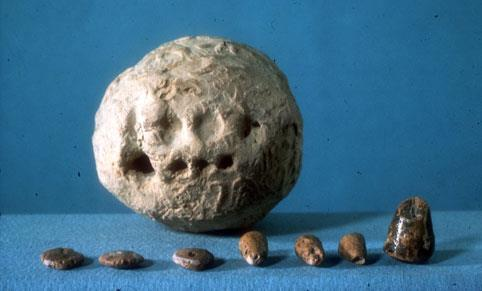

---

class: caption-slide

## Double Coincide of Wants

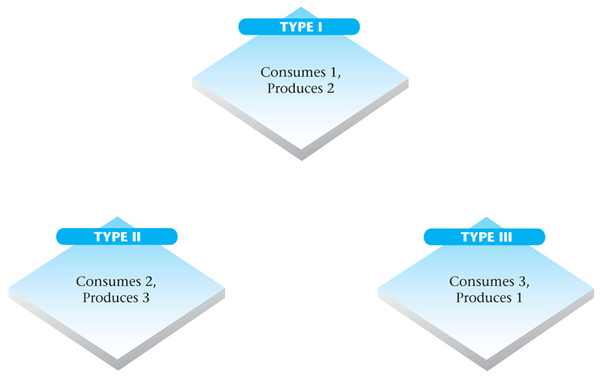

---

class: caption-slide

## Double Coincide of Wants

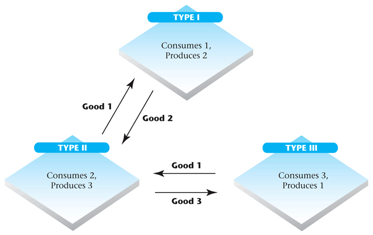

---

class: caption-slide

## Hammurabi’s Code

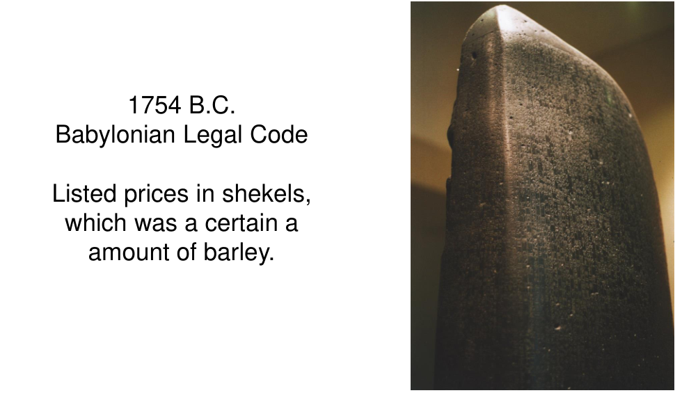

---

class: caption-slide

## Snails!

Monetaria Moneta, the Money Cowrie. The shells of these snails were widely used as money.

Left: [Live money snail. CC-BY-SA-5 Philippe Bourjon.](https://commons.wikimedia.org/wiki/File:Monetaria_moneta_-_2.jpg)
Center: [Ancient Chinese Shell Money. CC-BY-SA-3 PHGCOM.](https://commons.wikimedia.org/wiki/File:Chinese_shell_money_16th_8th_century_BCE.jpg)
Right: [Lithograph of traders using shells. 1845](https://commons.wikimedia.org/wiki/File:A_print_from_1845_shows_cowry_shells_being_used_as_money_by_an_Arab_trader.jpg)

---

class: caption-slide

## Knives and Spades

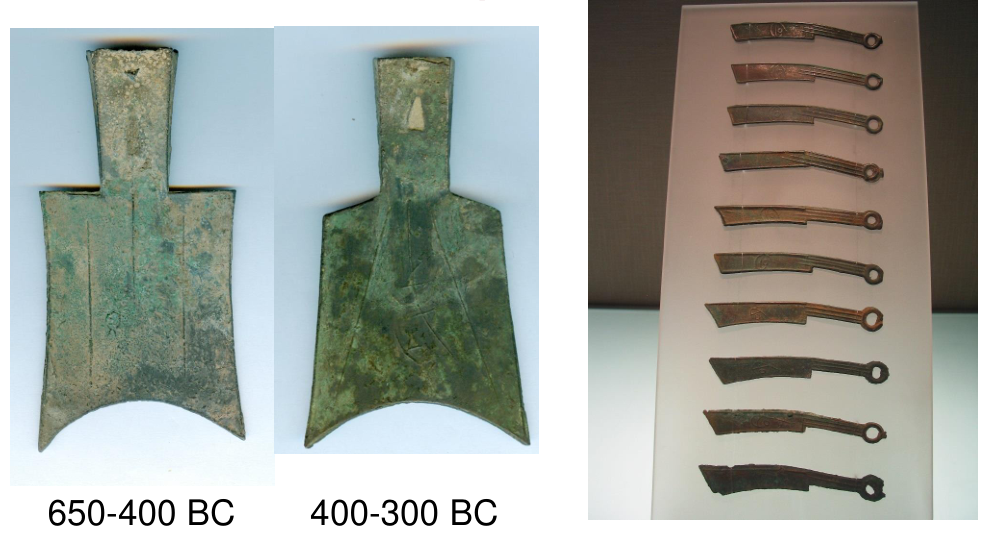

---

class: caption-slide

## Coins!

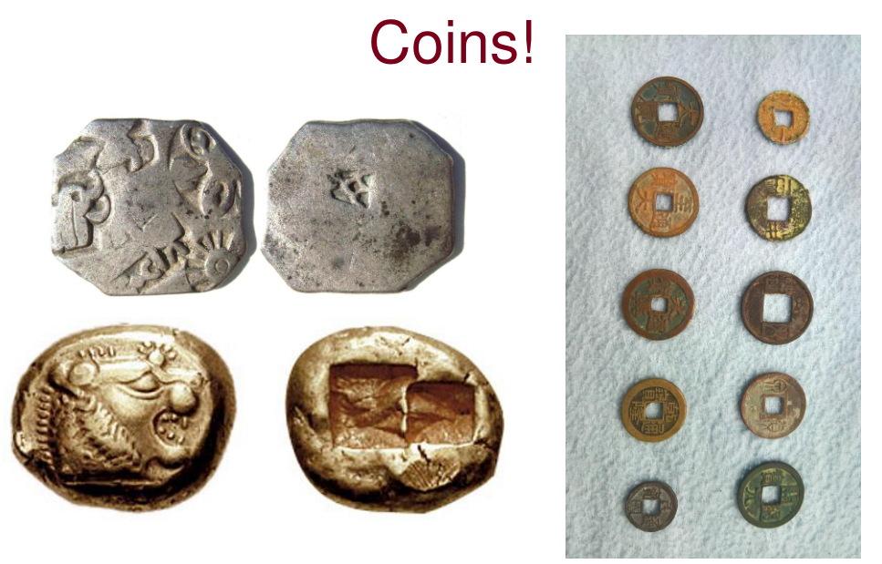

---

class: caption-slide

## Coins

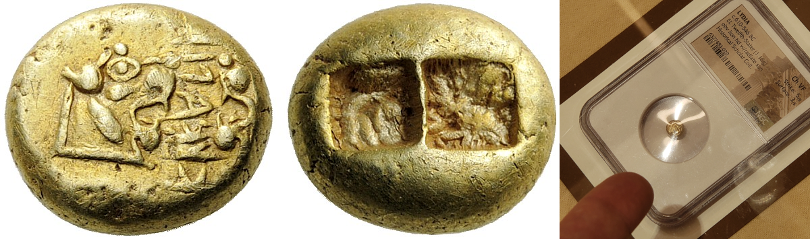

---

class: caption-slide

## Rai Stones

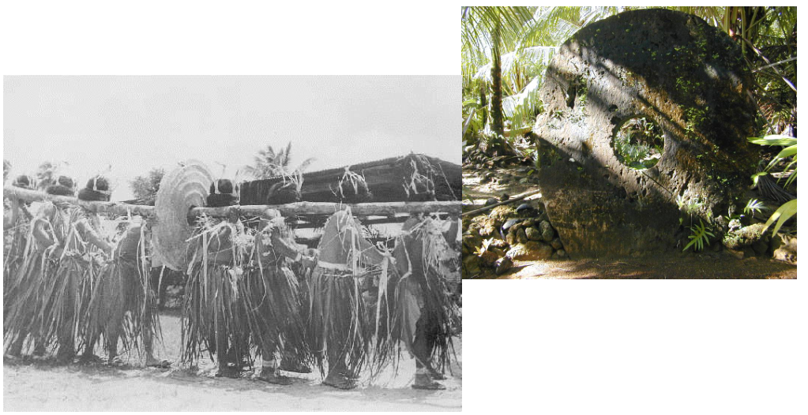

---

class: caption-slide

## Other Commodity Money

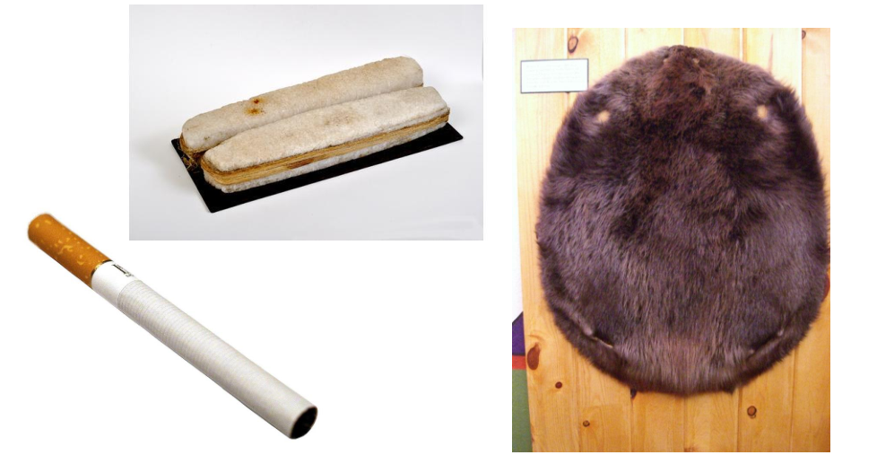

---

class: caption-slide

## Fiat Money

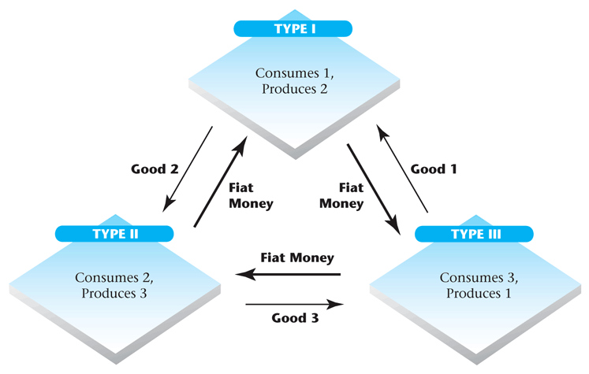

---

class: caption-slide

## Paper

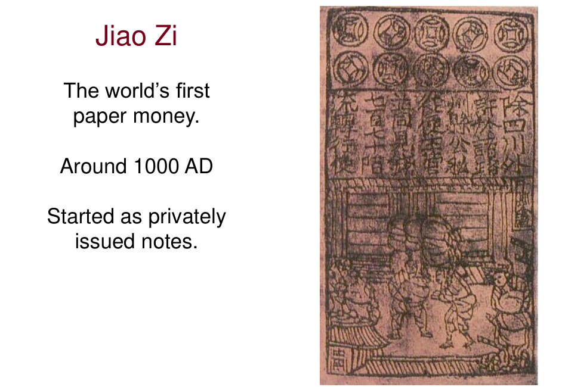

---

class: caption-slide

## Paper

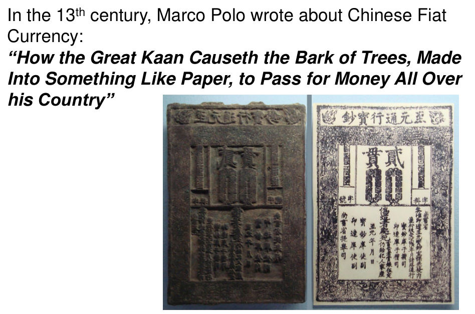

<!-- skip over playing cards for now -->

---

class: caption-slide

## Paper

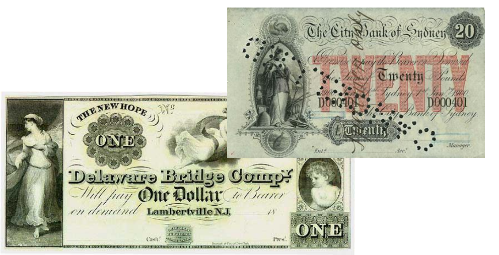

---

class: caption-slide

## Paper

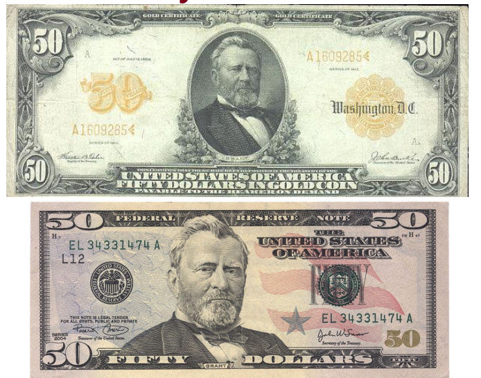

<!-- skip tally sticks -->

---

class: caption-slide

## Transaction Accounts

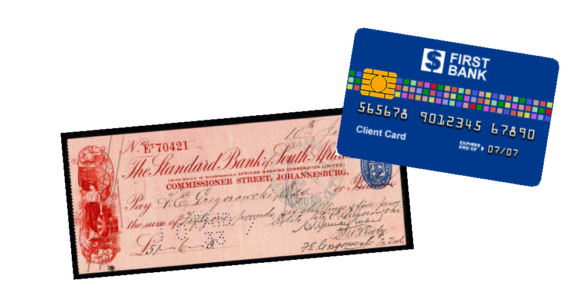

<!-- skipp bank strike -->

## Transaction Accounts

