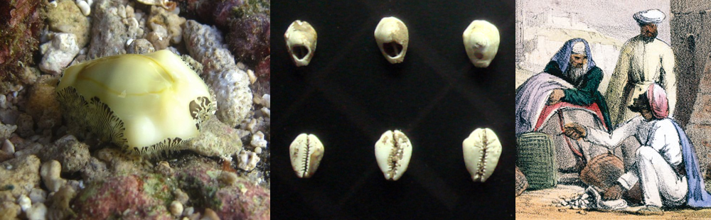
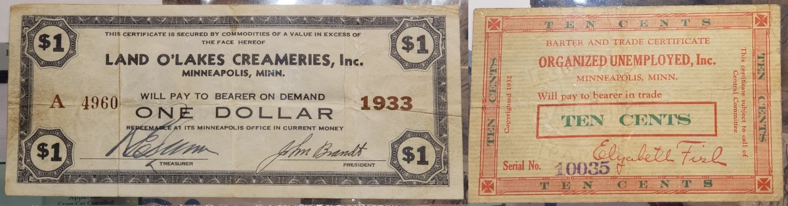

<!--last_modified_date: 2022-09-14-->

## Vocab to Remember

### Defining characteristics of money

- Medium of exchange
- Store of value
- Unit of account

### Forms of Money
- Commodity money
- Circulating private bank notes
- Commodity-backed paper currency
- Fiat money
- Transactions deposits at banks

### Measures of the Money Supply

| | MB | M1 | M2 |
|:--|:-:|:-:|:-:|
| Reserve Balances         | ✅ |  |  |
| Currency in a bank vault | ✅ |  |  |
| Currency in my pocket    | ✅ | ✅ | ✅ |
| Checking accounts |  | ✅ | ✅ |
| Savings accounts |  | [Since May, 2020](https://fredblog.stlouisfed.org/2021/01/whats-behind-the-recent-surge-in-the-m1-money-supply/) | ✅ |
| Time deposits |  |  | ✅ |

For more details, take a look at this page from the Federal Reserve: 
[Money Stock Measures - H.6 Release](https://www.federalreserve.gov/releases/h6/current/default.htm)

The Federal Reserve also use to publish a measure called M3,
but [decided that it wasn't worth the effort](https://www.federalreserve.gov/releases/h6/discm3.htm).

 
<!--https://fred.stlouisfed.org/graph/?g=12ew3-->

### How does the government actually change the money supply?

- Helicopter money: Increase the money money supply by decreasing taxes or equivalently increasing transfers.
- Seignorage: Government prints money to buy stuff.
- Open market operations: Increase money supply by decreasing government debt (ie by purchasing bonds).
  - Quantitative Easing: Like Open Market Operations, but with longer-term assets.

(But note that the Federal Reserve doesn't use the Money Supply as their main policy target.
Rather than using OMO to set the money supply to some specific amount,
the Fed has interest rate targets, and uses money-supply affecting policy 
as one of their tools to achieve those interest-rate targets.
[You can read about the details of how the Fed implements monetary policy here.](https://www.federalreserve.gov/econres/feds/the-feds-ample-reserves-approach-to-implementing-monetary-policy.htm)) 

## Some Amusing Historical Context

This section is a WIP.

### The origins of money

<!--The MB,M1,M2 Money Supplies are precisely defined.-->
In the broadest sense, *money* is simply 
any object or social technology that 
acts as a medium of exchange, store of value, and unit of account.
Money is a prehistoric phenomenon, 
invented and re-invented in many different times and places,
so we can't point to some specific instance where money was thought up.
But we can speculate about money's evolution from things that are *moneyish*.

- Barter networks converging to use specific commodities as mediums of exchange. As observed in trade networks in the Pacific, or with [cigarettes in Prisoner of War camps](http://icm.clsbe.lisboa.ucp.pt/docentes/url/jcn/ie2/0POWCamp.pdf).
  - The formalization of gift economies. <!--Which really aren't too dissimilar from barter.-->
- Some specific store of value, such as jewelry, acquiring a prestige that leads people to value other things in terms of comparison.
- A context-specific valuation, such as dowrie or weregild or taxes, spreading to become a more general unit of account.

### Examples of Commodity Currencies

<figure markdown="block">

<figcaption  markdown="block">Monetaria Moneta, the Money Cowrie. The shells of these snails were widely used as money.
 
Left: [Live money snail. CC-BY-SA-5 Philippe Bourjon.](https://commons.wikimedia.org/wiki/File:Monetaria_moneta_-_2.jpg)
Center: [Ancient Chinese Shell Money. CC-BY-SA-3 PHGCOM.](https://commons.wikimedia.org/wiki/File:Chinese_shell_money_16th_8th_century_BCE.jpg)
Right: [Lithograph of traders using shells. 1845](https://commons.wikimedia.org/wiki/File:A_print_from_1845_shows_cowry_shells_being_used_as_money_by_an_Arab_trader.jpg)
</figcaption>
</figure>

- [Spade Money, the earliest "coins".](https://www.nationalgeographic.com/history/article/worlds-oldest-coin-factory-discovered-in-china)
- Knife Money
- Lydian Coins

<figure markdown="block">

<figcaption markdown="block">Lydian Coinage from 2600 years ago.
 
Left: [Ancient Chinese Shell Money. CC-BY-SA-3 Classical Numismatic Group, Inc.](https://commons.wikimedia.org/wiki/File:Chinese_shell_money_16th_8th_century_BCE.jpg) Right: own photo.
Right: Own photo
</figcaption>
</figure>

- Beaver Pelts
- Rai Stones
- Cacao. (Ek Chuaj)

<!--
mention difficulties caused by gold thread
https://fraser.stlouisfed.org/blog/2023/04/historic-coin-production-us-mint/
-->

### Ancient Accounting Technology

- [Accounting Tokens](https://sites.utexas.edu/dsb/tokens/tokens/)
- Tally Sticks

### Paper Money

- Jiaozi
- Early US Currency

<!-- 
财富 財富 
https://commons.wikimedia.org/wiki/Commodity_money
-->

#### What happens when there isn't enough paper money?

<figure markdown="block">

<figcaption markdown="block">Early 1900s scrip issued in Minnesota.
 
From [the collection of Shawn Hewitt](https://shawnhewitt.com/). Own photo.
Right: Own photo
</figcaption>
</figure>

#### What happens when there's too much paper money?

Hyperinflation. Examples:

- Venezuela
- Zimbabwe
- Hungary

<!--- [Venezuela](https://tradingeconomics.com/venezuela/inflation-cpi)-->

### Transactions Accounts and the Future

Nowadays, most money is in the form of checking or savings accounts, where the thing being traded is just entries in a ledger.

Over the last decade, cryptocurrencies like Bitcoin have made quite a buzz.
The underlying technology, the blockchain, is a way of maintaining a ledger without a trusted authority.

And now there are talks about countries creating central bank digital currencies.
(Which wouldn't necessarily need to use a blockchain because they'd be administered by a central authority.)

Further reading: [The Future of Money and Its Implications for Society, Central Banks, and the International Monetary System](https://research.stlouisfed.org/publications/review/2022/12/23/the-future-of-money-and-its-implications-for-society-central-banks-and-the-international-monetary-system)

### A few entertaining reads

- [*A Survey Of Primitive Money*](https://archive.org/details/surveyofprimitiv033390mbp),
by Alison Hingston Quiggin, 1949. An anthropological description of many forms of money and money-adjacent phenomena.
- *Money: The Unauthorised Biography*, by Felix Martin, 2013. A popular modern account about the history of money. Martin argues that money in its modern form arose when Mesopotamian accounting technology collided with Greek social notions of universal value. A poetic take, if one a bit too tidy for my taste.
- [*The Cambist and Lord Iron: A Fairy Tale of Economics*](https://www.lightspeedmagazine.com/fiction/the-cambist-and-lord-iron-a-fairy-tale-of-economics/), by Daniel Abraham. In this short story, the titular cambist is tasked with calculating three very strange exchange rates. The first is solid economics. The second is a bit of a stretch. The third is pure fantasy.

<!--
### Is the Use of Money a form of barter?

The Andaman Islanders, the Australians, the Eskimo, the Central
Asiatics and the Maori have neither geographical environment nor
race in common, but they are (or were) alike in one characteristic,
a comparative self-sufficiency. In these so-called primitive societies where division of labour, save between men and women, scarcely
exists, where each family group could provide for its own needs without outside help or external supplies, currency is not to be looked for;
trade can scarcely develop;
barter is rarely organized; 
and though
there is present-giving, it has little commercial importance. But groups so independent and so self-contained are rarely found;
even among the most aloof there are indications of
extra attractions and external contacts, and women are generally the
disturbing element.
Abundant illustrations will be found in the
following pages:a brief glance at what is happening in the Solomon
Islands at the present time, showing successive stages in the evolution
of the use of money, may form the prelude.

'No study so successfully combats the error of separating history into watertight compartments as the study of numismatics,'says Scltman in an earlier volume
of this series (1933, p. 265), and the study of money before
it becomes numismatics is even less lamenable to such separation.

EVERYONE, except an economist, knows what'money' means,
and even an economist can describe it in the course of a chapter or
so, but it is impossible to define with rigid outlines.
It emerges dimly from objects of presentation or exchange, and shades imper-
ceptibly into recognizable monetary forms with uncertain boundaries
on either hand, and much of the material of this book hovers on the
borders.

> For the two parties in a transaction may themselves stand in different categories. The trader may consider that he is paying current money when he buys a fowl for ten lengths of brass wire; while the seller regards the exchange as 'mere barter'. 
-- A.H. Quiggin, A Survey of Primitive Money: the Beginnings of Currency

[A Survey Of Primitive Money](https://archive.org/details/surveyofprimitiv033390mbp),
Alison Hingston Quiggin, 1949

[Primitive Money](https://archive.org/details/in.ernet.dli.2015.190322/), Paul Einzig, 1947

-->

