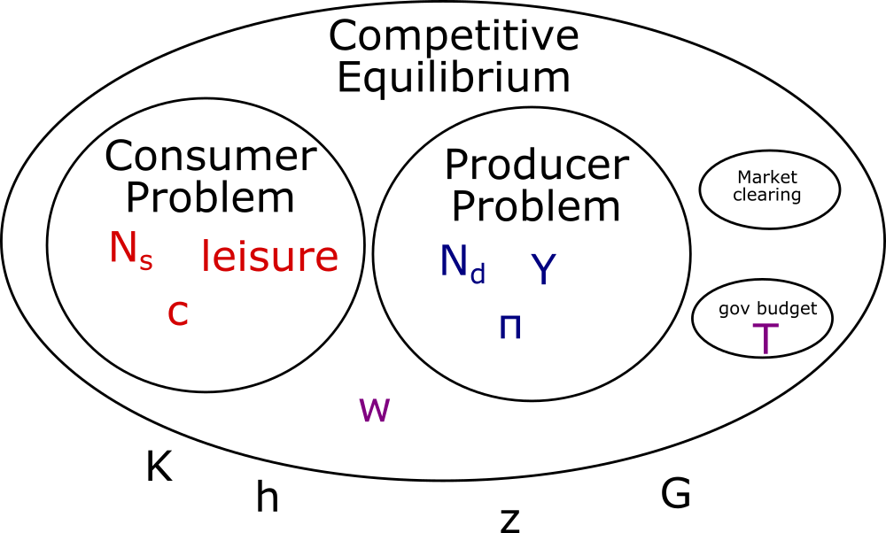

<!--TODO: note about prices and allocations in this model-->
<!--TODO: note about how the model is real, so price of consumption is just 1-->

## The Basic Recipe for a Competitive Equilibrium Model

Given `{exogenousParameters}` a competitive equilibrium is any set of endogenous `{prices}` and endogenous `{allocations}` which satisfies the following conditions:
- Price-taking agents are optimizing. <!--(We talked about these in ch 4.) -->
- Markets clear.
- (sometimes other constraints, typically just something like a government's budget balance)

### Price-Taking Agents

This is the aspect that gives the "competitive" aspect to a "competitive equilibrium".

Price-taking agents takes prices as given when they optimize.
Even though the equilibrium price may depend on the decisions that these agents make,
they treat those prices *as if* they were exogenously fixed when making those decisions.

Examples:
    - Firms who act as profit-maximizers, taking the price of inputs and outputs as given.
    - Consumers who maximize their utility function subject to some budget constraint, taking the price of goods and real wage as given.

### Market Clearing Conditions

This is the "equilibrium" in "competitive equilibrium".

For markets to clear, it means that Supply = Demand for anything that is split up or traded between agents.
All our quantities need to be balanced, with nothing disappearing or appearing out of thin air.

Examples:
    - Amount of goods consumed = amount of goods produced.
    - Amount of labor supplied = amount of labor demanded.

## The Competitive Equilibrium Model from Chapter 5

### The Full Definition

Definition of the Closed Economy 1-Period Competitive Equilibrium

Given the exogenous parameters $\lbrace K,h,z,G\rbrace$,
a competitive equilibrium is any set of endogenous prices $\lbrace w\rbrace$ and allocations $\lbrace c,l,N_{s},N_{d},Y,T,\pi\rbrace$ that satisfy the following conditions:

- Representative Consumer optimizes: Treating prices $\lbrace w\rbrace$ and $\lbrace T,\pi\rbrace$ as given, the consumer chooses $\lbrace c,l,N_{s}\rbrace$ to solve

$$\begin{aligned}
\max_{\lbrace  N_{s},l,c\rbrace} & U(c,l) \\
\text{s.t. } & c\geq0,\ \ \ l\geq0,\ \ \ N_{s}\geq0 \\
 & c\leq w\cdot(h-l)+\pi-T \\
 & N_{s}=(h-l) 
\end{aligned} 
$$

- Representative Firm optimizes: Treating prices $\lbrace w\rbrace$ as given, the firm chooses $\lbrace N_{d},Y\rbrace$ to solve:

$$\begin{aligned}
\max_{Y,N_{d}} & \ \pi \\
\text{s.t. } & N_{d}\geq0,\ Y\geq0 \\
 & \pi = Y-wN_{d} \\
 & Y=zF(K,N_{d}) 
\end{aligned} \\
$$

- Markets Clear:
  
  $$Y=C+G$$
  
  $$h-l=N_{s}=N_{d}$$

<!--- Profit is $\pi=Y-wN_{d}$-->

- Government Budget is balanced:$T=G$

### The Price-taking agents.

For this model, we have two price-taking agents:
- The representative consumer.
- The representative firm.

### The Market Clearing Conditions

In this model, there are two things which are traded between agents: labor, and goods.

So the two market clearing conditions are that:

- Labor supplied must equal labor demanded. $h-l=N_{s}=N_{d}$
- The amount of amount produced must equal the amount of output used $zF(K,N_{d})=Y=c+G$

<!--Technically only one of these is needed.-->

### Other Constraints (government budget)

The only other constraint in this version of the model is that the government's budget must be balanced.

To keep things simple in this model, we represent the government with the following assumptions:

- Government spending $G$ is exogenously specified, and must be funded.
- The government raises funds through a lump-sum tax on consumers, $T$.
- The government's budget must be balanced, meaning that the following equality holds:
    
  $$T=G$$

Not that the government isn't an agent in this version of the model.
They don't *choose* how much to spend. 
There is just some exogenous amount of government expenditures that must be satisfied (you might imagine this as national defense).

You can set up a equilibrium model where the government is an optimizing agent, but that would make the algebra more complicated.

<!--TODO: Characterizing equations.-->

## A note about Endogeneity

While the prices are endogenous to the competitive equilibrium, they are exogenous to each individual agent's problem.

A visual analogy might help. Each bubble below represents a set of constraints. Any parameters inside a bubble are endogenous to that problem; any parameters outside it are exogenous to that problem.

