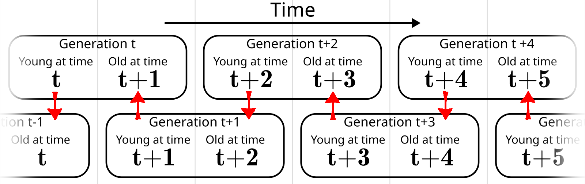

Social security at its core is a transfer from the young to the old.[^otherssprograms]
We want to give money to the elderly. In order to fund this, we need to take money from young people at some point.

[^otherssprograms]: "Social security" can be used in a broad sense to refer to all sorts of welfare and social insurance programs. For example, in the United States, the official name of social security is actually "Old-Age, Survivors, and Disability Insurance". But given that nearly everyone grows old, this makes up the largest part of any such program, and is what we focus on here.

## Overlapping Generations (OLG) Model 

The simplest version of an overlapping generations model looks something like this:

- A generation is born each time period, and lives for two time periods. 
- Generation $t$ is young during time period $t$, old during time period $t+1$ and doesn't exist during any other time period.
- There is a generation born every time period. And so the lifespan of a generation "overlaps" with the generations which come before and after.
- Generation $t$ is young at the same time that generation $t-1$ is old. Generation $t$ is old at the same time generation $t+1$ is young. 
- There are infinite time periods. Often they start with generation $0$, who has no older generation to overlap with.

## Fully Funded Social Security:

A fully funded system takes money from young people, saves it, and give then gives it back to those same people later when they are old.
Your generation pays for their own benefits.

In the absence of a social security program, generation $t$'s budget constraints look like this:

$$c_t + s_t \leq y_t\\
c_t' \leq y_t' + (1+r) s_t$$

or in intertemporal terms:

$$c_t + \frac{c_t'}{1+r} \leq y_t + \frac{y_t'}{1+r}$$

Now let's institute a fully funded system. We will tax the person T when they are young, and give them
benefits B when they are old:

$$c_t + \frac{c_t'}{1+r} \leq y_t - T + \frac{y_t' + B}{1+r}$$

How big are the benefits compared to the taxes?
The government collects $T$ in taxes, saves them, then pays out the returns, so $B=(1+r)T$.
Plug this into the budget constraint and...

$$c_t + \frac{c_t'}{1+r} \leq y_t - T + \frac{y_t' + (1+r)T}{1+r} = y_t + \frac{y_t'}{1+r}$$

... nothing really changes.
This kind of program is essentially just forced savings. 
Potentially makes things worse if their are credit market imperfections.
There are arguments for this kind of system (see chapter 10 in the book), but not within our simple 2 period model.

## Pay-as-you-go Social Security:

A pay-as-you-go system takes money from people who are currently young and gives it to people who are currently old.
You pay for the benefits of the previous generation.

To look at the effects this has on the consumer's budget constraint, 
we need to know about the relative size of each generation.
For simplicity, assume the following:
- Your generation, the generation born in time period $t$, has $N_{t}$ population
- The older generation, who are old when you are young, has population $N_{t-1}$.
- The younger generation, who is young when you are old, has population $N_{t+1}$.
- Say that population is growing at rate $n$, so $N_{t+1}=(1+n)N_{t}$ for any $t$. $N_{t}=(1+n)N_{t-1}$.

Let's also assume that the program is stable over time, collecting the same taxes from each person when they are young and paying out the same benefits when they are old.

When you are young, Government collects $T$ in taxes, which are immediately paid out as benefits to the people who are already old.

Then when you are old the government collects $T$ in taxes from each young person,
and pays out $B$ benefits to each old person, including you.
How big are your benefits?

- Total taxes collected: $T \cdot N_{t+1}$
- Benefits paid out: $B \cdot N_{t}$
- In a pure pay-as-you-go system, these two are equal, so 

$$T \cdot N_{t+1} = B \cdot N_{t}\\
B = T \cdot \frac {N_{t+1}}{N_{t}} = T \cdot (1+n)$$

Plug this into the budget constraint and...

$$c_t + \frac{c_t'}{1+r} \leq y_t - T + \frac{y_t' + (1+n)T}{1+r} = y_t + \frac{y_t'}{1+r} + \left(\frac{1+n}{1+r} -1 \right)T$$

Iff $n > r$, then this program makes them better off, in intertemporal terms, than they would be without the program.
Or in other words, if the population growth rate is higher than the real interest rate,
inter-generational transfers can have a higher "return" than savings.
This allows for this kind of social security program to potentially be a pareto improvement in our model.

<!--Vocab term: Moral Hazard - If you are protected from risk, you might behave in a more risky fashion.-->