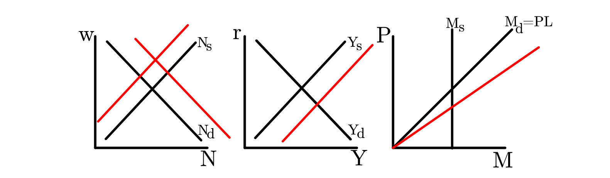
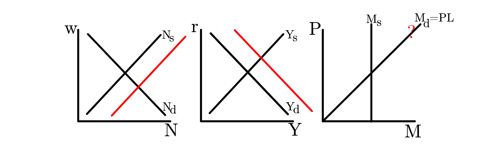
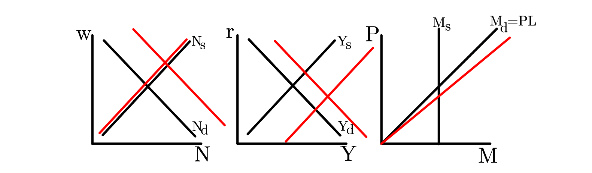
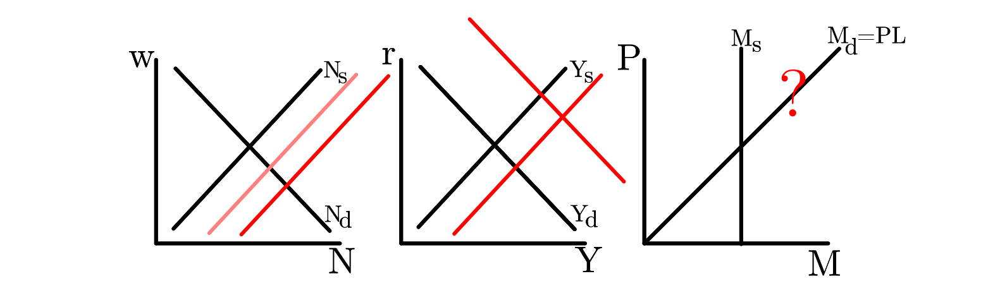
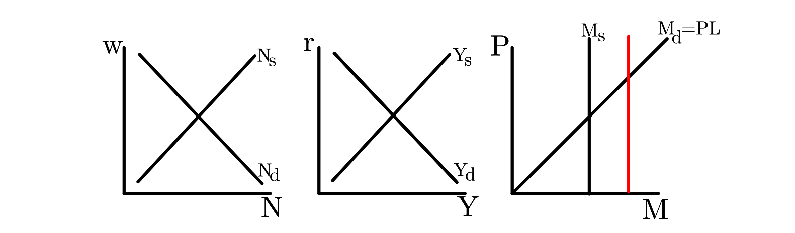
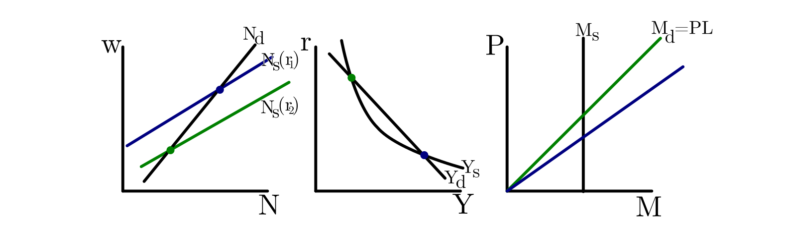

## Basic Model with the "Classic Dichotomy"

### Shocks to Exogenous Variables

#### Increase in $z$:
An increase in total factor productivity shifts the $N_d$ curve to the right, which shifts $Y_s$ to the right. Then the
decrease in equilibrium $r$ causes the $N_s$ curve to shift left. Equilibrium output increases and interest rate falls,
so liquidity demand increases, meaning that $M_d$ curve tilts right. It is ambiguous whether employment increases or decreases.

#### Increase in $z'$:
An increase in future total factor productivity $z'$ increases investment demand, shifting the $Y_d$ curve to the right.
Then the increase in equilibrium $r$ causes the $N_s$ curve to shift right. Output increases but so does the interest rate,
so the change in liquidity demand is ambiguous.

#### "Persistent" Increase in Total Factor Productivity:
An increase in $z$, combined with a smaller increase in $z'$:

#### Increase in $G$:

An increase in Government Expenditures $G$ requires an increase in taxes to pay for these expenditures. The consumer
responds to this increase in taxes, in part by working more, making the $N_s$ curve shift right and thus the $Y_s$ curve to
also shift right. $G$ also directly shifts $Y_d$ to the right (consumption demand decreases but by less than the increase in $G$). Then the change (probably an increase) in equilibrium $r$ causes the $N_s$ curve to shift again (probably to the right).

#### Increase in $M_S$ :

Prices increase. By assumption, that is the only thing that changes. This is the "classic dichotomy". No effect on
real economy.

### Comparing to Real-World Business Cycle Patterns

See chapter 3 for the discussion of business cycle patterns. In a business cycle expansion, output increases above
trend, as does consumption, investment, employment, and real wage.
If we look at the shocks above, the shock that best replicates this pattern is the persistent shock to total factor
productivity. So the basic version of our model suggests that business cycles are caused by changes in the ability to produce outputs. This is called the "Real Business Cycle" theory. It’s a decent fit for some recessions, but doesn’t seem like a sensible story for explaining something like the Great Depression or 2008 financial
crisis.
See chapters 9 and 11 for the discussion of labor and asset markets. See chapters 12 and 13 for discussion of how
money is added to the model.

## Coordination Failure Model

See chapter 13 for details.

### Changes to the Basic Model

In the basic model, we assume that aggregate production exhibits constant returns to scale in capital and labor. So
holding capital constant, there are decreasing returns to scale in labor alone. The N d curve is determined by the set
of points where w = MP N , and so decreasing returns to scale in labor yield a downwards-sloping N d curve.

Instead, in this version of the model, we assume that production is increasing returns to scale. And we assume
that the increasing returns to scale are so large that we get increasing returns to scale in labor alone , even
when holding capital constant. This gives us an upwards sloping N d curve, and thus a downwards sloping Y s curve.
If the curves intersect at multiple points, then there may be multiple equilibrium for the same parameters.

<!--Note that I drew the graphs slightly differently in lecture. But the key concept to remember is the same: Increasing returns to scale may lead to multiple equilibriums.-->

### Comparing to Real-World Business Cycle Patterns

Notice that in this version of the model:

- One of the equilibriums has high employment, high real wages, high output, low interest rates, and thus high liquidity demand. Also, because of the low real interest rates, consumption and investment are high.
- The other equilibrium has low employment, low real wages, low output, high interest rates, and thus low liquidity demand. Also, because of the high real interest rates, consumption and investment are low. The difference between the two equilibriums is similar to the difference between an expansion and a recession. So this version of the model tells a story where business cycles are just fluctuations between different possible states of the economy, perhaps driven by nothing more than people’s mood or ‘sunspots’.

## Sticky Prices Model

See chapter 14 for details.

### Changes to the Basic Model

In this version, prices are sticky. $P$ can’t change. Remember that money demand is equal to price times liquidity demand. In the
basic version of the model, an increase in the money supply changes equilibrium by changing the price level. Here,
it must instead be the liquidity demand that changes. And liquidity demand can increase by either increasing output or
decreasing the interest rate.
In the basic version of the model, the equilibrium interest rate is determined by output supply and demand. But
now, the interest rate is exogenously determined by monetary policy, and so the asset market may not necessarily
clear. By assumption in this version of the model, when $Y_s \neq Y_d$, then the $Y_d$ is what determines the equilibrium quantity of
output. Firms must hire however much labor is needed to meet this quantity of output demanded.

### Comparing to Real-World Business Cycle Patterns

In the following graphs, government policy is such that the resulting real interest rate is above the "natural" rate of
interest. So output, consumption, investment, employment, and real wages are all lower than the levels which would
be efficient.
So this model suggests that a recession occurs when markets are in disequilibrium because of poorly targeted
monetary policy.

#### An increase in $M_s$

When the real interest rate is too high, the government can expand the money supply. Because Prices are assumed
to be fixed, this instead results in an increase in liquidity demand by lowering interest rates and increasing output.
If targeted optimally, this monetary expansion sets the equilibrium interest rate equal to the natural rate.

