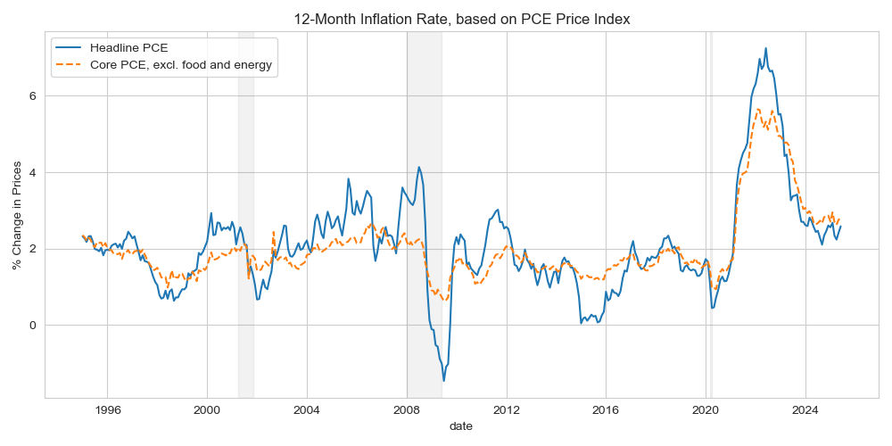

## Instructions

Each problem in this assignment asks you to work with data and answer one or more reflection questions about the data.
Each chart you produce *must* be clearly labeled, self-contained, and easy to read. 
Your answers to the reflection questions should be succint and insightful. 
When writing your answers, imagine that you are preparing a report for your very busy, non-economist, manager.

You must submit one report (preferable in PDF format) to D2L, 
which contains all of your charts and your answers to the questions.
Once again, your analysis and charts must be self-contained and clearly labeled. 

You are allowed to work with others on this assignment, but:
- Be sure to include attribution at the top of your submission. If someone helped you create a document, their name should be somewhere on the document.
- Submitted work should be your own. *(Charts will naturally look similar. That’s fine.)*

## Data Sources:

- [BEA table 2.8.4 - PCE PI by Type of Product, Monthly, Seasonally Adjusted](https://apps.bea.gov/iTable/?reqid=19&step=2&isuri=1&categories=survey#eyJhcHBpZCI6MTksInN0ZXBzIjpbMSwyLDMsM10sImRhdGEiOltbImNhdGVnb3JpZXMiLCJTdXJ2ZXkiXSxbIk5JUEFfVGFibGVfTGlzdCIsIjgxIl0sWyJGaXJzdF9ZZWFyIiwiMTk5NSJdLFsiTGFzdF9ZZWFyIiwiMjAyNSJdLFsiU2NhbGUiLCIwIl0sWyJTZXJpZXMiLCJNIl1dfQ==)
- [Fred version of Table 2.8.4](https://fred.stlouisfed.org/release/tables?rid=54&eid=3208#snid=3199) - Only some of the rows are included in FRED, unfortunately.
    <!-- - [PCEPI](https://fred.stlouisfed.org/series/PCEPI) - "Headline" PCE Price Index.
    - [PCEPILFE](https://fred.stlouisfed.org/series/PCEPILFE) - "Core" PCE Price Index, which excludes food and energy. -->

## PROBLEMS: 

### Problem 1: Plot PCE Inflation from FRED

For many basic questions about economic data, FRED is an excellent resource. 
For later questions, we'll need to download data and work with it in a spreadsheet,
but for this first question, we'll use FRED's built-in graphing tools. 

I will show you in class how to create a chart in FRED showing the inflation rate as calculated using monthly data for two different chain-type price indices based on Personal Consumption Expenditures:
- [PCEPI](https://fred.stlouisfed.org/series/PCEPI) - "Headline" PCE Price Index.
- [PCEPILFE](https://fred.stlouisfed.org/series/PCEPILFE) - "Core" PCE Price Index, which excludes food and energy.

#### Questions: 
- Create a chart in FRED plotting 12-month inflation as calculated from the "Headline" PCE Price Index and the "Core" PCE Price Index, from 1995 to the most current date available.
- Why is headline PCE inflation more variable than core PCE inflation? [Max: 12 words]

<!-- 
The resulting graph should look similar to this one:

-->

Your chart will look similar to this one, 
but with different time periods and perhaps with different styling:

<!-- https://fred.stlouisfed.org/graph/?g=1LK9C -->

<!-- 

### Problem 2: Plot PCE Inflation from FRED

Inflation is very difficult to predict.  It turns out a “naïve” forecast that inflation over the next 12 months will be the same as inflation over the last 12 months is surprisingly good.  Using this “naïve” forecast, is the current core PCE inflation or the current headline PCE inflation a better predictor of headline PCE inflation over the next 12 months?

Download monthly data from FRED for the headline and core PCE price indices – PCEPI and PCEPILFE from July 1994 thru July 2025.  

Compare the forecast properties of the two predictors over the last 30 years using a root mean square error statistic:
RMSE=  1/30 ∑_(t=1995:7)^(2024:7)▒(π_t^f-π_(t=12)^h )^2 
where π_t^f if your forecast variable (either core PCE π_t^c or headline PCE π_t^h).  Use only July data for each year so that the periods do not overlap (and thus are closer to independent).  

	Give the RMSE for headline and core inflation.

	Is core or headline a better forecast of headline inflation?  Explain your reasoning using the RMSE of each predictor.  [Max: 10 words]

Shreyas – I have not done this, but it should be that … Core is a better predictor.  It has a lower RMSE (x vs y).  

 -->

<!-- 
General ideas for related HW:
Apply/calculate weights ourselves? https://www.bea.gov/help/faq/1006

Calculate/verify overall pce?
BEA table 2.8.3 and 2.8.5 have PCE quantities.
BEA table 2.8.4 has prices. (Used in this assignment.)
BEA table 2.8.5 is the dollar value of PCE components?

-->