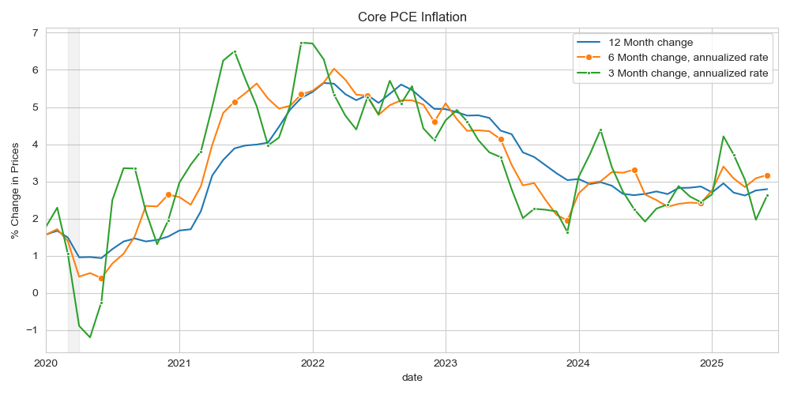

## Instructions

Each problem in this assignment asks you to work with data and answer one or more reflection questions about the data.
Each chart you produce *must* be clearly labeled, self-contained, and easy to read. 
Your answers to the reflection questions should be succint and insightful. 
When writing your answers, imagine that you are preparing a report for your very busy, non-economist, manager.

You must submit one report (preferable in PDF format) to D2L, 
which contains all of your charts and your answers to the questions.
Once again, your analysis and charts must be self-contained and clearly labeled. 

You are allowed to work with others on this assignment, but:
- Be sure to include attribution at the top of your submission. If someone helped you create a document, their name should be somewhere on the document.
- Submitted work should be your own. *(Charts will naturally look similar. That’s fine.)*

## Data Sources:

- [BEA table 2.8.4 - PCE PI by Type of Product, Monthly, Seasonally Adjusted](https://apps.bea.gov/iTable/?reqid=19&step=2&isuri=1&categories=survey#eyJhcHBpZCI6MTksInN0ZXBzIjpbMSwyLDMsM10sImRhdGEiOltbImNhdGVnb3JpZXMiLCJTdXJ2ZXkiXSxbIk5JUEFfVGFibGVfTGlzdCIsIjgxIl0sWyJGaXJzdF9ZZWFyIiwiMTk5NSJdLFsiTGFzdF9ZZWFyIiwiMjAyNSJdLFsiU2NhbGUiLCIwIl0sWyJTZXJpZXMiLCJNIl1dfQ==)
- [Fred version of Table 2.8.4](https://fred.stlouisfed.org/release/tables?rid=54&eid=3208#snid=3199) - Only some of the rows are included in FRED, unfortunately.
    <!-- - [PCEPI](https://fred.stlouisfed.org/series/PCEPI) - "Headline" PCE Price Index.
    - [PCEPILFE](https://fred.stlouisfed.org/series/PCEPILFE) - "Core" PCE Price Index, which excludes food and energy. -->

<!-- ## PROBLEMS:  -->

## Problem 1: Plot PCE Inflation from FRED

For many basic questions about economic data, FRED is an excellent resource. 
For later questions, we'll need to download data and work with it in a spreadsheet,
but for this first question, we'll use FRED's built-in graphing tools. 

I will show you in class how to create a chart in FRED showing the inflation rate as calculated using monthly data for two different chain-type price indices based on Personal Consumption Expenditures:
- [PCEPI](https://fred.stlouisfed.org/series/PCEPI) - "Headline" PCE Price Index.
- [PCEPILFE](https://fred.stlouisfed.org/series/PCEPILFE) - "Core" PCE Price Index, which excludes food and energy.

### Problem 1 Questions: 
- Create a chart in FRED plotting 12-month inflation as calculated from the "Headline" PCE Price Index and the "Core" PCE Price Index, from 1995 to the most current date available.
- Why is headline PCE inflation more variable than core PCE inflation? [Max: 20 words]

<!-- 
The resulting graph should look similar to this one:

-->

Your chart will look similar to this one, 
but with different time periods and perhaps with different styling:

<!-- https://fred.stlouisfed.org/graph/?g=1LK9C -->

## Problem 2: Naive Inflation Forecasts

Inflation is very difficult to predict.  It turns out a "naive" forecast that inflation over the next 12 months will be the same as inflation over the last 12 months is surprisingly good. 
Using this "naive" forecast, let's check whether current *core* PCE inflation or the current *headline* PCE inflation is a better predictor of headline PCE inflation over the next 12 months.

For this we'll need to download monthly data from FRED for the headline and core PCE price indices – PCEPI and PCEPILFE from June 1994 thru June 2025. After the data is downloaded, filter it to only observations from the month of June (this will keep our time periods from overlapping). 
<!-- and calculate the 12-month inflation for each price index, as we did in Problem 1. -->

Then we'll compare the forecasting quality of the two predictors using using a mean square error (MSE) statistic:

$$MSE=  \frac{1}{30} ∑_{t=1995}^{2024}(π_t^f-π_{t+1}^h)^2 $$

where $π_t^f$ is your forecast variable 
(either core PCE $π_t^c$ 
or headline PCE $π_t^h$)
and $π_{t+1}^h$ is the headline inflation for the following year.

### Problem 2 Questions: 

- Give the RMSE for headline and core inflation as predictors of headline inflation.
- Is core or headline a better forecast of headline inflation?  Explain your reasoning using the MSE of each predictor.  [Max: 20 words]

## Problem 3: 3-month and 6-month Inflation

In assessing the outlook for (12-month) inflation, it is informative to look at how inflation has behaved in the last 6-months and the last 3-months. 
Annualized inflation for monthly data is computed as:  

$$π_t=\left[\left(\frac{P_t}{P_{t-m}} \right)^{(12/m)}-1\right]\times 100$$

where $P_t$ is the price index and $m$ is the number of months we are looking at the change over.

Download a series for the core PCE price index (PCEPILFE) from FRED and use it to calculate 
the 3, 6, and 12 month annualized rates of core inflation (e.g. use m = 3, 6, 12 in the formula above).

### Problem 3 Questions: 
- Plot the 3, 6, and 12 month annualized rates of core inflation from 2020 to the most current date available.

- How do the latest 3 and 6 months rates influence your thinking on whether core PCE inflation is returning to 2% in the coming several months? [use bullets: 3 bullets max; 15-words max per bullet].

Your chart will look similar to this one:

<!-- 
This was a failed attempt to answer this question entirely in FRED.
I couldn't figure out how to calculate 3-month inflation for each month in FRED
https://fred.stlouisfed.org/graph/?g=1LK9C
This is instead the percent change or core PCE inflation at different frequencies.
 -->

<!-- 
General ideas for related HW:
Apply/calculate weights ourselves? https://www.bea.gov/help/faq/1006

Calculate/verify overall pce?
BEA table 2.8.3 and 2.8.5 have PCE quantities.
BEA table 2.8.4 has prices. (Used in this assignment.)
BEA table 2.8.5 is the dollar value of PCE components?

-->